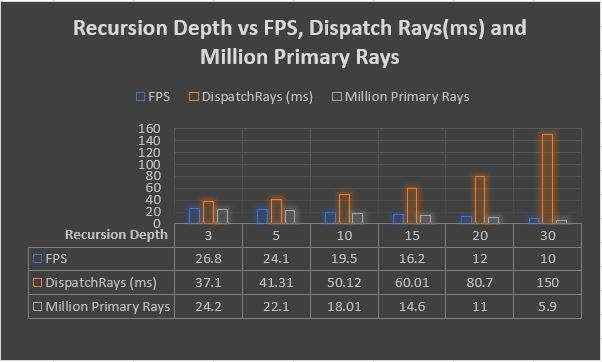
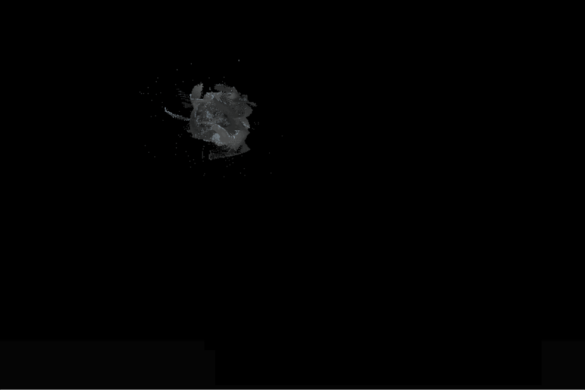

**University of Pennsylvania, CIS 565: GPU Programming and Architecture,
Project 5 - DirectX Procedural Raytracing**

* Dewang Sultania
  * [LinkedIn](https://www.linkedin.com/in/dewang-sultania/)
* Tested on: Windows 10, Intel Xeon E-2176M @ 2.70GHz 16GB, Quadro P2000 4GB (Personal Computer)

### Table of Contents
1. [Project Description](#overview)
2.   [Performance Analysis](#perf)
3.   [Bloopers](#bloop)

<a name = "overview"/>

## Project Description

This repository contains code for Procedural Ray tracing using DirectX. The project involves two major components:
*  Building a DXR rendering pipeline
*  Raytracing procedural geometries using the pipeline.

Ray tracing is a process similar to path tracing, except that it is deterministic and that we only do a single pass over the entire scene. This image summarizes what goes on in ray tracing:

Specifically, the DXR execution pipeline mimics all the interactions depicted above. This diagram summarizes the DXR execution pipeline:

This does not prevent us from calling `TraceRay()` multiple times. In fact, any self-respecting raytracing project will allow multiple (~3) `TraceRay()` calls. The common denominator between ray and path tracing is the depth of the ray. In this project, we use a *minimum depth of 3* to allow tracing the following:

1. a **primary (radiance) ray** generated from the camera
2. a **shadow ray** just in case the ray hits a geometry on its way to the light source
3. a **reflection** ray in case the material of the object is reflective

Therefore, the lifecycle of a single ray can be thought of as follows:

1. generate a ray, see if it hits something
2. if it hits something, then attempt to *light/color* it
    * attempting to color that hit point is equivalent to **tracing that ray towards the light source**. 
    * if that ray hits *another* object on its way to the light, then the region is effectively shadowed
    * if not, then we successfully colored that point
3. if at any point we hit a reflective material, then trace another ray in the reflected direction and repeat the process

The algorithm sounds simple enough when serialized, but the challenge is to make it performant and fast. Enter: **GPUs**. Deploying a raytracing program on the GPU is not trivial. The difficulty of raytracing lies in the fact that **ALL data must be available before any raytracing happens**: 

    * all geometries must be positioned within an acceleration structure (KD-Tree, Bounding Volume Hierarchy, or whatever your choice is..)
    * the camera must be set up
    * the light sources must be configured
    * the shading logic must be configured
    * and the output buffer must be ready

In essence, the entire *ray tracing pipeline* must be ready on the GPU. A good chunk of DXR is spent setting that up from the CPU. Once the GPU knows about all the details on the pipeline, it can execute the ray tracing algorithm. The DXR API is made to facilitate setting up all of these things.

<a name = "perf"/>

## Performance Analysis

<a name = "bloop"/>

## Bloopers

