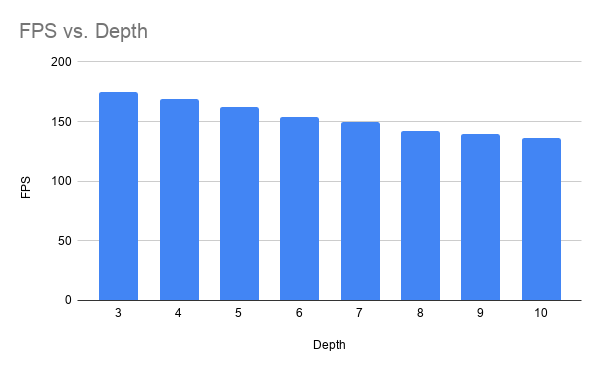
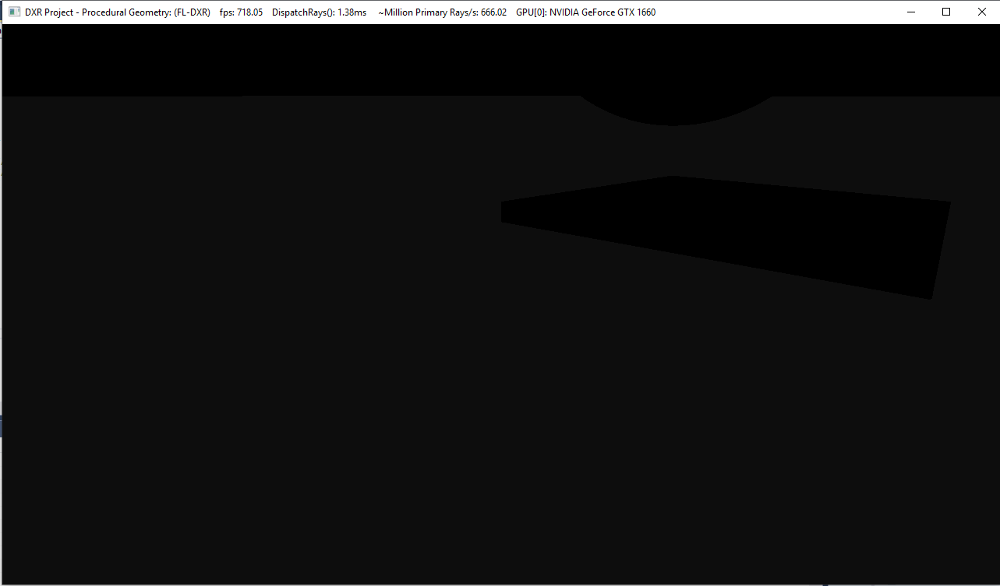
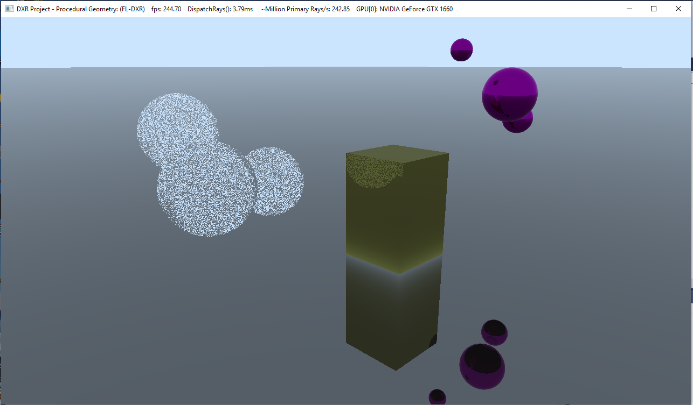
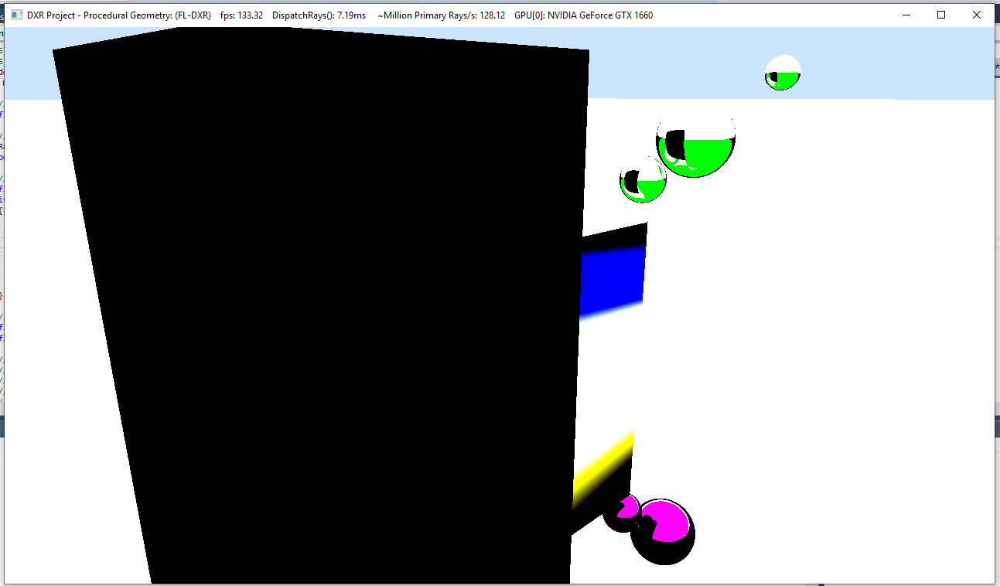
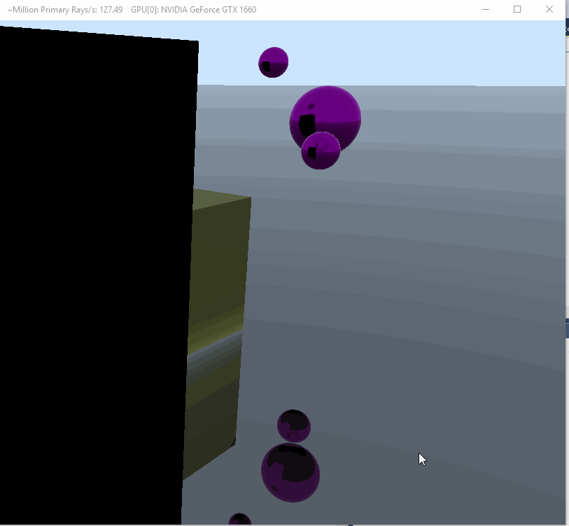

**University of Pennsylvania, CIS 565: GPU Programming and Architecture,
Project 5 - DirectX Procedural Raytracing**

* Eric Micallef
  * https://www.linkedin.com/in/eric-micallef-99291714b/
  
* Tested on: Windows 10, i5, Nvidia GTX1660 (Personal)

- [Overview](#Overview)
- [Performance Analysis1](#Performance-Analysis)
- [Debilitating Bugs/Bloopers](#debilitating-bugs-aka-bloopers-in-cis565-world)
- [references](#references)

# Overview

DirectX12 what more can I say ... It is nifty in theory but debilitating in practice RIP to those who will use this in practice one day.

# Performance Analysis

Below are some data points after manipulating the recursion depth. As you can see, the further we follow the slower our application becomes. This is fairly intuitive.

# Debilitating Bugs aka bloopes in CIS565 world

After watching my program crash 10000000000000000000 times because my cpu side was wrong, finally I got something up... but then I had to sadly go back and fix alot of stuff ... 

turns out there was alot wrong here ... alot ... But I do like the darker purple and darker yellow colors!

my lerping for fading was off.. way offf.... Lerping is not to be confused with the ever popular LARPing.

If you look you can see that the two purple balls move in a very odd manner. was kind of neat.

problem was my logic for keeping track of closet hit was a bit off. I was keeping track of tmax, a sensical person would have looked at the function return and saw it was evaluating thit... I became sensical after about 2 hours of debugging.

# references

Ziad ... without him I would have thrown my computer out the window

http://viclw17.github.io/2018/11/29/raymarching-algorithm/
https://www.freecodecamp.org/news/understanding-linear-interpolation-in-ui-animations-74701eb9957c/	
https://www.scratchapixel.com/lessons/3d-basic-rendering/minimal-ray-tracer-rendering-simple-shapes/ray-sphere-intersection
https://www.scratchapixel.com/lessons/3d-basic-rendering/minimal-ray-tracer-rendering-simple-shapes/ray-box-intersection
https://www.scratchapixel.com/lessons/3d-basic-rendering/phong-shader-BRDF

