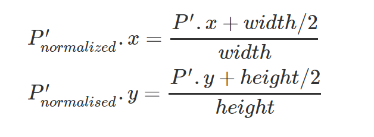
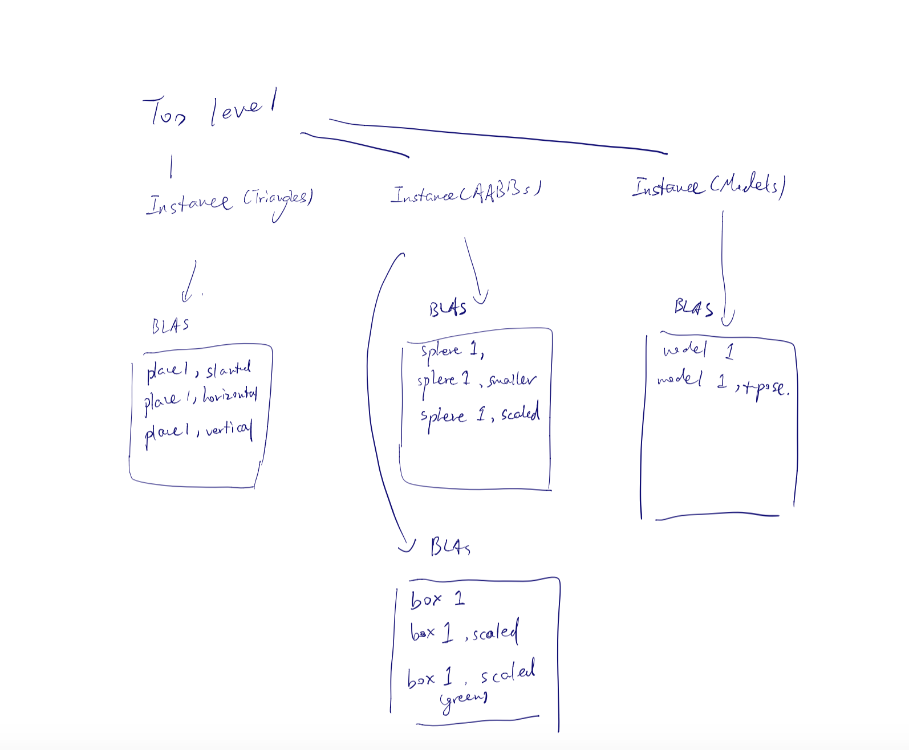
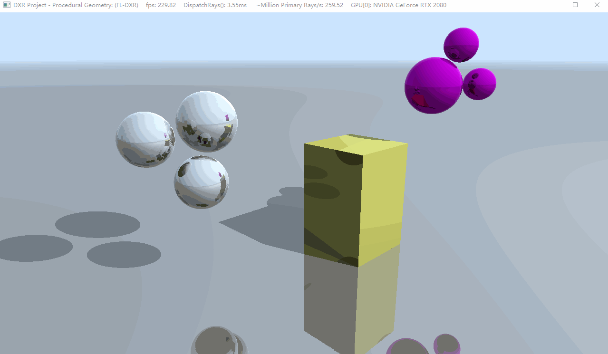
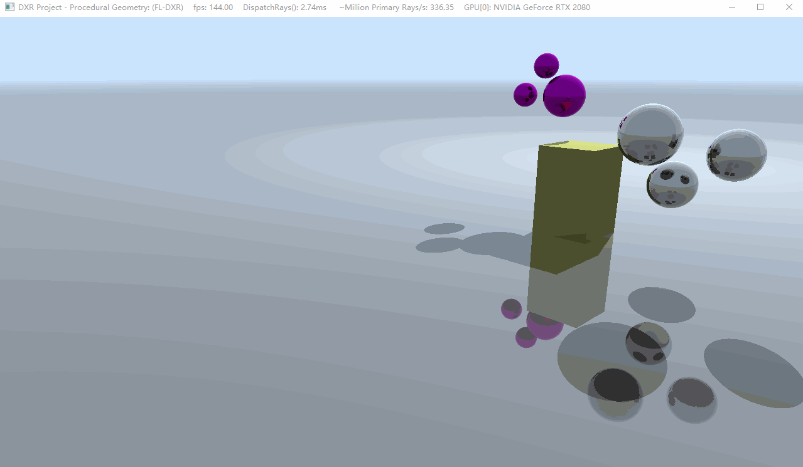
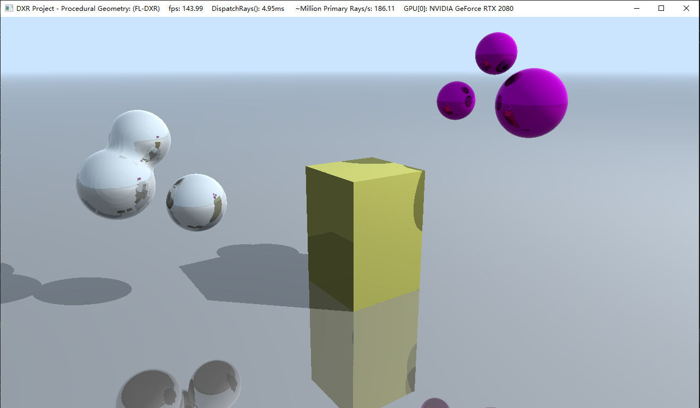
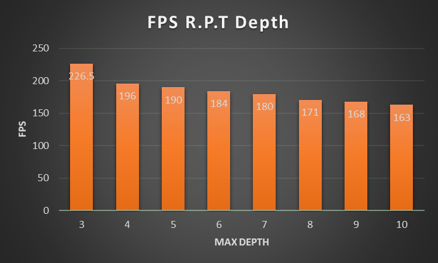

**University of Pennsylvania, CIS 565: GPU Programming and Architecture,
Project 5 - DirectX Procedural Raytracing**

- #### Author information

  - Tianming Xu (Mark)
    - www.linkedin.com/in/tianming-xu-8bb81816a (LinkedIn)
  - Tested on: Windows 10, i7-8700 @ 3.20GHz 16GB, GTX 2080 8192MB (my personal desktop)

### Conceptual questions

1. Ray tracing begins by firing off rays from the camera's perspective, with 1 ray corresponding to 1 pixel. Say the viewport is (1280 by 720), **how would you convert these pixel locations into rays**, with each ray being defined by an `Origin` and a `Direction`, such that `Ray = Origin + t * Direction`? Consult this [intro](https://www.scratchapixel.com/lessons/3d-basic-rendering/computing-pixel-coordinates-of-3d-point/mathematics-computing-2d-coordinates-of-3d-points) to camera transformations and this [explanation](http://webglfactory.blogspot.com/2011/05/how-to-convert-world-to-screen.html) of world-to-screen/screen-to-world space article to formulate an answer in your own words.

   Answer: First of all, the camera is just a normal 3D object in the scene, we have its origin and the up, front and right vectors in the view matrix. We extract the origin of the camera to be the origin of all the rays we shoot from the camera. In order to determine the direction, we know each ray is from camera to the corresponding pixel location. The pixel location is in screen space, we need to first transform its (x,y) value back to the world space. We can make it by first apply the inverse of

   

    and then apply the inverse of our projection matrix and inverse matrix. Now, we have the correct x,y value of pixel position in the world space. We need to then determine the z-value. As the image plane is one unit away from our camera in z-coordinate in world space, we make the z-value of pixel location to be camera's origin's z-value + 1. We can compute the world space position of each pixel in this method, then we have a image plane in world space for us to fire off ray from the camera.

2. Each procedural geometry can be defined using 3 things: the `Axis-Aligned Bounding Box` (AABB) (e.g. bottom left corner at (-1,-1,-1) and top right corner at (1,1,1)) that surrounds it, the `Type` (e.g. Sphere) of the procedural geometry contained within the AABB, and an `Equation` describing the procedural geometry (e.g. Sphere: `(x - center)^2 = r^2`). **Using these 3 constructs, conceptually explain how one could go about rendering the procedural geometry**. To be specific, consider how to proceed when a ray enters the AABB of the procedural geometry.

   Answer: For rendering the procedural geometry, we need to shoot ray from camera to the scene and let ray intersect with the geometry. First of all, as procedural geometries are normally bounded by a AABB box, we need to determine whether rays intersect with AABB box first. If not, then the ray must not hit the geometry. If the ray hit the AABB box, we keep going through the smaller bounding boxes within the parent AABB box until we hit a leaf level bounding box. When the ray hits a leaf level bounding box, it means that it has high possibility to hit the geometry. We then compute the start point of the intersection with AABB and the end point of the AABB, note down the t values. We split the t values into several pieces, and then use the equation, which describes the shape of the geometry, and the ray equation to compute whether the point on ray is actually in, on or outside the geometry. As the procedural geometry might have several equations to define the whole shape. We calculate the value of all those equations and sum them up. If the final result is larger than the render threshold we define for the shape. The ray hits the geometry and we will render it. Otherwise, the ray doesn't hit the geometry.
3. **Draw a diagram of the DXR Top-Level/Bottom-Level Acceleration Structures** of the following scene. Refer to section 2.6 below for an explanation of DXR Acceleration Structures. We require that you limit your answer to 1 TLAS. You may use multiple BLASes, but you must define the Geometry contained within each BLAS.

   Answer: Here is the acceleration structures I think of the scene

   

###  Project Overview

​	In this project, we finish a ray tracer using Microsoft latest Direct X ray tracing API: DXR.  The most challenging things in this project is to understand this latest API and call the appropriate functions in the appropriate place. After I implement this project, I have a better understanding of this powerful API now.

​	Besides a basic ray tracer on the fixed geometry, we add some animation features in this project: camera animation, geometry animation on the sphere and metaball and light animation. These added features make the scene become more interesting. 

### Final Render Image

1. With geometry animation

   

2. With camera animation

   1. 

3. With Light animation

   1. 

4. No animation

   1. 

### Performance Analysis

The performance of the project depends on the max depth we trace. Here is the chart showing this.

### Acknowledgements

​	I can't finish this project without the help of Jiangping Xu, Ziad and many people who struggled together in the Friday afternoon lab. I really appreciate all of their helps and advice to help me debug out problems.
