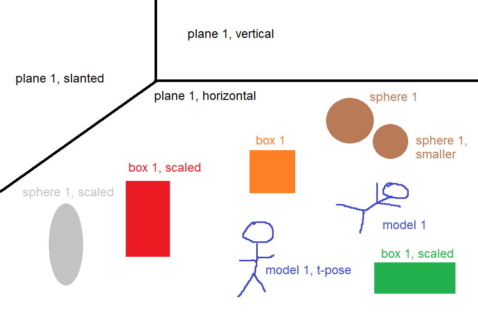
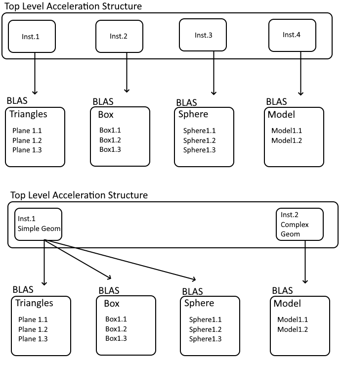

DXR Raytracing
================

**University of Pennsylvania, CIS 565: GPU Programming and Architecture, Project 3**

* John Marcao
  * [LinkedIn](https://www.linkedin.com/in/jmarcao/)
  * [Personal Website](https://jmarcao.github.io)
* Tested on: Windows 10, i5-4690K @ 3.50GHz, 8GB DDR3, RTX 2080 TI 3071MB (Personal)

# Conceptual Questions

## Question 1
To get each pixel mapped to a ray, we need to make a couple transformations and mappings between the camera and the world. First of all, every object is mapped to the world space at first. Even the camera has a position and a normal in world space. So the first step is to take the local coordinates of the camera and transform it to world space. This is done by multiplying the camera's position by the transformation vector Mcamera-to-world.
This will move our coordinate system so that the camera is defined with respect to the world origin. We then have to map each (relevant) point in world space to camera space. This is done by mapping each point to a place one unit away from the camera point that is, in this case, 1280 pixels wide and 720 pixels tall. We start this by converting each point to be mapped with respect to the camera's position using the equation PCamera = PWorld * MWorld-to-Camera. The 3D points can then be mapped to 2D points on the Camera's plane by the following.

P'.x = Pcamera.x / -Pcamera.z

P'.y = Pcamera.y / -Pcamera.z

Note the negative sign, this is done because the camera is defined as looking down the negative Z-axis.
With the point P', we have define the position of a 3d object in the 2d plane seen by the camera. This space then is trimmed to match the height and width mentioned. If P'.x is greater than the width/2, or P'/y is greater than height/2, then the object will not be rendered in the screen.
The last step is to transform the point P' to raster space, that is such that its coordinate will align exactly with its pixel position on the screen. This is done by taking the origin to be the top left corner of the screen. Each point is normalized by the following.

P'normalized.x = (P'.x + width/2) / width

P'normalized.y = (P'.y + height/2) / height

And then finally, it is multiplied by the width and height provided.

P'raster.x = floor(P'normalized.x * Pixel Width)

P'raster.y = floor((1 - P'normalized.y) * Pixel Height)

Again, noting that y is inverted because the origin is the top left of the screen.

## Question 2
Each procedural geometry is defined by its Axis-Aligned Bounding Box (AABB), its Type, and its Type's associated Equation. When detecting collisions for each ray, the collision is first checked against the AABB. If the AABB is hit, then a more complicated check follows. Otherwise, the ray ignores the geometry. If a collision is detected with the AABB, then the shader calls a intersection test function depending on the Shape of the object. For example, a Sphere is defined by the function (x-center)2 = r2. The ray is checked against this internal geometry to see if the collision happens or not. The origin and direction of the ray, with respect to the AABB, is tested against the geometry inside. If a collision is detected, then the rasterizer will render the ray at the point of intersection. If no intersection occurs inside the AABB, then no point is rendered.

## Question 3
Acceleration on the GPU is done by using Top Level Acceleration Structures (TLAS) and Bottom Level Acceleration Structures (BLAS). Each TLAS holds possibly many instances of BLAS. A BLAS may be referenced by multiple TLAS. For the example shown below...

... the acceleration structures can be defined like one of the two examples below. The top example assigns each instance in the TLAS to a different geometry type, while the second example joins together simple geometries together.

