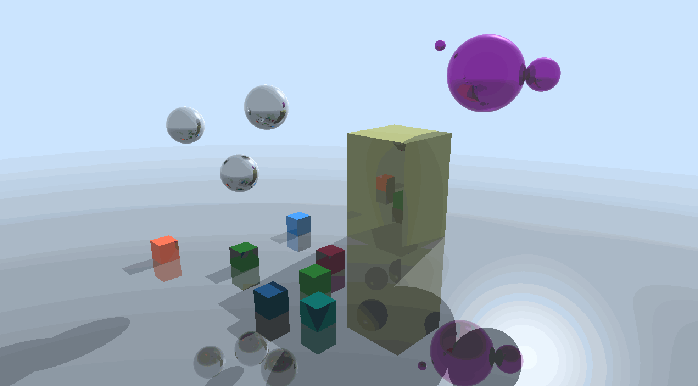
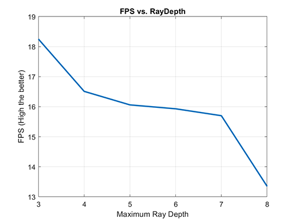

# DirectX Procedural Raytracing
**University of Pennsylvania, CIS 565: GPU Programming and Architecture,
Project 5 - DirectX Procedural Raytracing**

* Zheyuan Xie
* Tested on: Windows 10 Pro, i7-7700HQ @ 2.80GHz, 16GB, GTX 1050 2GB (Dell XPS 15 9560)

## Introduction

This project implemented ray tracing for procedural geometry using Direct X 12 Raytracing API.

Keyboard Shortcut:

 - `C` - enable/disable camera animation.
 - `G` - enable/disable geometry animation.
 - `L` - enable/disable light animation.

## Features
### Axis-aligned bounding boxes

### Spheres

### Metalballs

## Performance Analysis

## Reference
 - [Microsoft Direct3D 12 programming guide](https://docs.microsoft.com/en-us/windows/win32/direct3d12/directx-12-programming-guide)
 - [3D Game Engine Programming - Learning DirectX 12](https://www.3dgep.com/learning-directx-12-2/#Introduction)
 - [Microsoft DirectX-Graphics-Samples](https://github.com/microsoft/DirectX-Graphics-Samples)
 