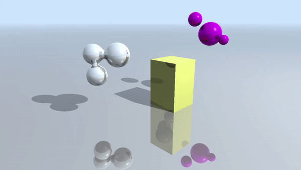
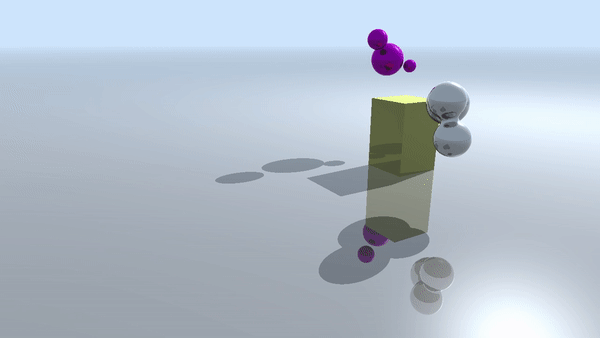
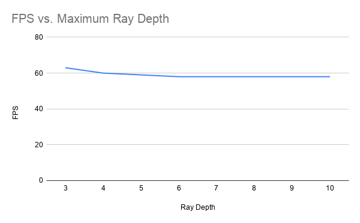
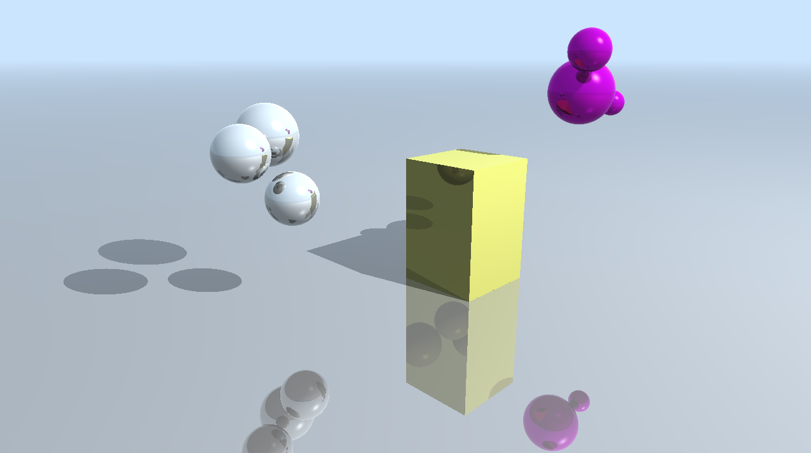
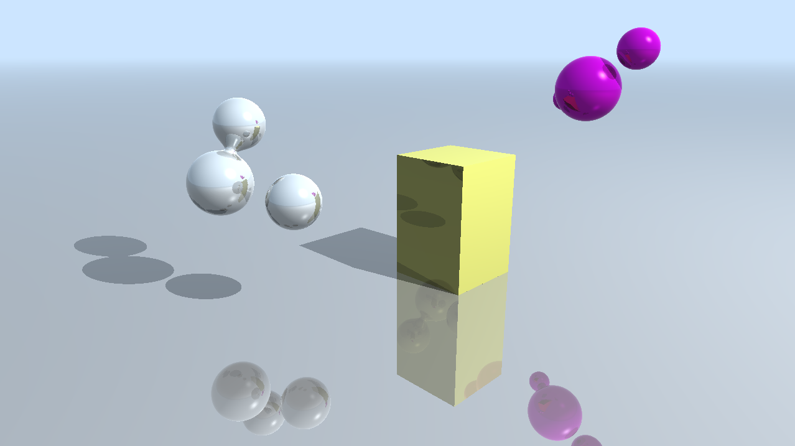
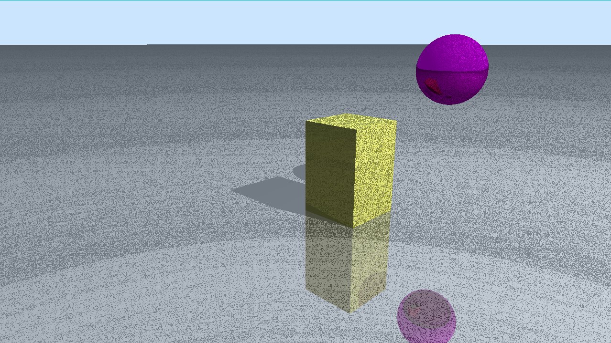
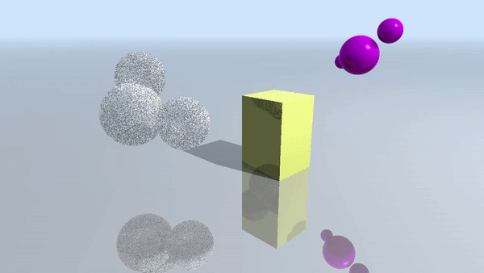

# DirectX Procedural Raytracing
**University of Pennsylvania, CIS 565: GPU Programming and Architecture,
Project 5**

Caroline Lachanski: [LinkedIn](https://www.linkedin.com/in/caroline-lachanski/), [personal website](http://carolinelachanski.com/)

Tested on: Windows 10, i5-6500 @ 3.20GHz 16GB, GTX 1660 (personal computer)

## Project Description

The goal of this project was to utilize DirectX's new raytracing functionality (DXR) to implement a real-time raytraced scene using mainly procedural geometry.

### Raytracing

In a typical raytracer, for each pixel in our image, we shoot one ray (called a view ray or radiance ray) from the camera into our scene. We determine where that ray intersects the scene. Perhaps it intersects a sphere geometry in our scene, as shown in the image below. If we find an intersection, we also shoot another ray (a shadow ray), from our intersection position to each of the lights in our scene. If a shadow ray hits the light without hitting another object in our scene, we know there is light energy coming from that light to our intersection position. If the shadow ray intersects another object before reaching the light, our intersection position is in shadow. 

We then want to figure out the color to shade that intersection location, which we can do using a number of different shading models (Lambert, Blinn-Phong, etc.). A reflective material might require us to shoot a third ray, a reflection ray, starting from our intersection location. We use that ray's intersection (or lack thereof) to help shade our current location, as it tell us what is reflected in our original intersection. The result of our shading calculation ultimately becomes the color of the pixel.

### DXR

DirectX Raytracing helps facilitate a lot of above functionality by utilizing built-in hardware operations specific to raytracing. The below diagram summarizes the DXR execution pipeline:

For example, given the above description of raytracing, TraceRay() would potentially be called three times, once for the radiance ray, once for the shadow ray, and once for the reflection ray. Functionality such as determining what happens when an object is intersected or when a ray doesn't intersect anything is handled by defining code segments such as Intersection shaders or Miss shaders, respectively.

### Geometry and Acceleration Structures

There are two types of geometry included in our scenes, Triangle geometry (the ground plane, and potentially any triangle mesh included in the scene) and Procedural geometry (the box, spheres, and metaballs). Each primitive is contained within an axis-aligned bounding box (AABB). While intersections with the triangle geometry are found using DXR's built-in triangle-intersection functionality, intersections with the procedural geometry are defined by custom Hit shaders written by us. For example, determining the ray's intersection with the box is the same as determining intersection with an AABB. Intersection with metaballs requires ray-marching through all of the metaballs to determine the first location with a "potential" (based on our ray's location's distance to the each of the metaball centers) surpassing a predefined threshold.

However, determining a ray's intersection with a scene can be very costly, especially as you increase the amount of geometry within the scene, since you normally have to test the ray's intersection with every primitive. Luckily, DXR has a built-in acceleration structure system. The entire scene is divided into Top Level Acceleration Structures (TLAS), which themselves hold multiple instances of Bottom Level Acceleration Structures (BLAS). In turn, a BLAS holds geometry data. This project uses a relatively simple acceleration structure setup:

## Performance

We can look at the effect of the maximum ray recursion depth on performance (higher FPS is better):

Contrary to what was expected, changing the maximum ray depth has little effect on performance. Only reflection rays would potentially use the full recursion depth (a reflection ray hits another reflective surface, creating another reflection ray, and so on), so perhaps most of these rays are terminating early (by not intersecting anything within the scene).

An important factor to consider is that changing the maximum ray depth has little to no apparent visual effect:

Max Depth: 3 | Max Depth: 10 | 
--- | --- | 
 |  |

## Bloopers

Had some pretty bad shadow acne at one point:

The metaballs in my first pass were really disco metaballs:

