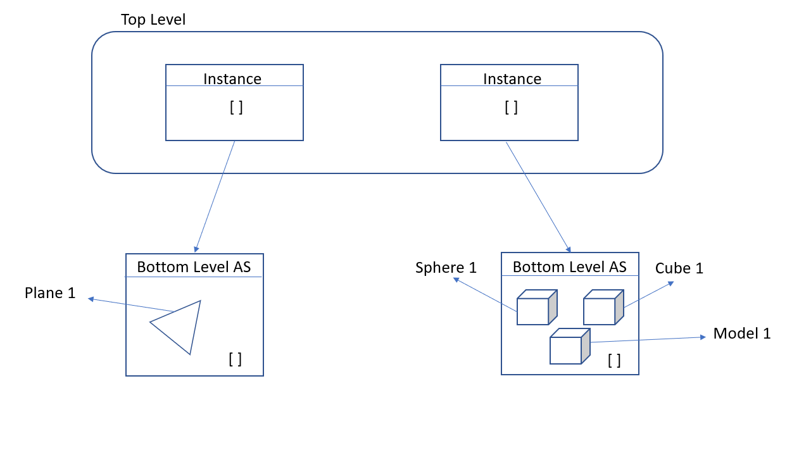

**University of Pennsylvania, CIS 565: GPU Programming and Architecture,
Project 5 - DirectX Procedural Raytracing - Conceptual Questions**

* Saket Karve
  * [LinkedIn](https://www.linkedin.com/in/saket-karve-43930511b/), [twitter](), etc.
* Tested on:  Windows 10 Education, Intel(R) Core(TM) i7-6700 CPU @ 3.40GHz 16GB, NVIDIA Quadro P1000 @ 4GB (Moore 100B Lab)

## Answers to questions

1. Ray tracing begins by firing off rays from the camera's perspective, with 1 ray corresponding to 1 pixel. Say the viewport is (1280 by 720), **how would you convert these pixel locations into rays**, with each ray being defined by an `Origin` and a `Direction`, such that `Ray = Origin + t * Direction`? Consult this [intro](https://www.scratchapixel.com/lessons/3d-basic-rendering/computing-pixel-coordinates-of-3d-point/mathematics-computing-2d-coordinates-of-3d-points) to camera transformations and this [explanation](http://webglfactory.blogspot.com/2011/05/how-to-convert-world-to-screen.html) of world-to-screen/screen-to-world space article to formulate an answer in your own words.

**Answer**

To convert pixel locations into rays, we need to convert the pixel co-ordinates into corresponding world co-ordinates to get the 'direction' component of the ray. The 'origin' of the ray is the center of the camera with respect to the world co-ordinates.

Suppose the camera is positioned at (Cx, Cy, Cz) with respect to the world co-ordinates. Then the origin of any ray generated from this camera will be (Cx, Cy).

For a point on the image plane (canvas) with pixel co-ordinates (X, Y), we need to do the following in order to convert it to world co-ordinates,
1. Normalize the pixel co-ordinates (X, Y) with respect to the canvas.
2. Transform the these normalized co-ordinates such that the center of the canvas is at (0, 0) in some co-ordinate system to get (XN, YN)

If W = Width and H = Height,

XN = 2 * (X - W/2)/W

YN = 2 * (Y - H/2)/H

3. Convert these co-ordinates to world co-ordinates by multiplying by the inverse of world projection matrix to get (XW, YW)
4. The direction of the ray will be defined as (XW, YW).

The final ray will thus be defined as ```ray = (Cx, Cy) + t * (XW, YW)```

2. Each procedural geometry can be defined using 3 things: the `Axis-Aligned Bounding Box` (AABB) (e.g. bottom left corner at (-1,-1,-1) and top right corner at (1,1,1)) that surrounds it, the `Type` (e.g. Sphere) of the procedural geometry contained within the AABB, and an `Equation` describing the procedural geometry (e.g. Sphere: `(x - center)^2 = r^2`). **Using these 3 constructs, conceptually explain how one could go about rendering the procedural geometry**. To be specific, consider how to proceed when a ray enters the AABB of the procedural geometry.

**Answer**

When a ray enters the AABB of a procedural geometry, we need to

- Convert the ray description to the local coordinate system of the AABB of concern. This means we need to transform the ray's origin and direction component to the coordinate system with origin at the center of the AABB of concern.
- Using the type of object in the AABB and its equation (which we assume is with respect to the AABB's local coordinate system), calculate the intersection (t) and direction of the normal at the point of intersection.
- Connvert the normal's origin (point of intersection) and direction to the world coordinate system.


3. **Draw a diagram of the DXR Top-Level/Bottom-Level Acceleration Structures** of the following scene. Refer to section 2.6 below for an explanation of DXR Acceleration Structures. We require that you limit your answer to 1 TLAS. You may use multiple BLASes, but you must define the Geometry contained within each BLAS.

**Answer**


