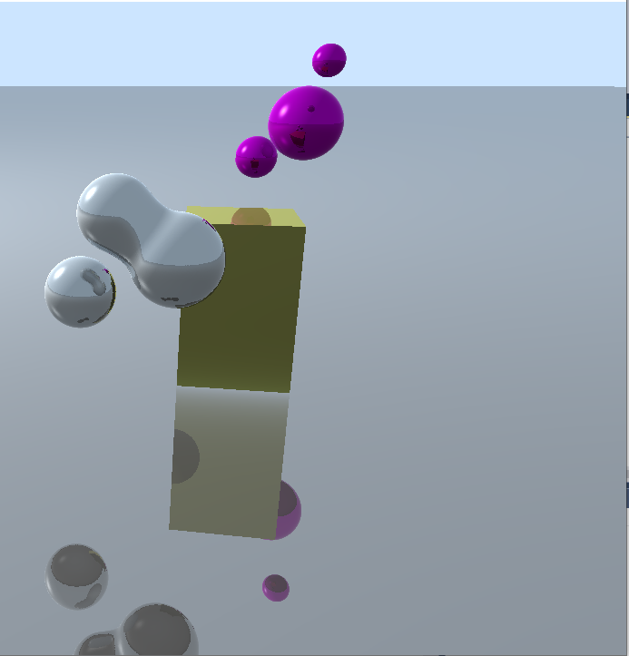
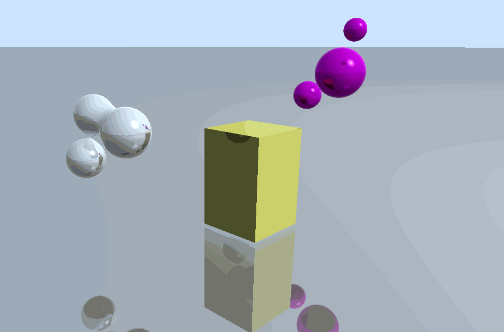
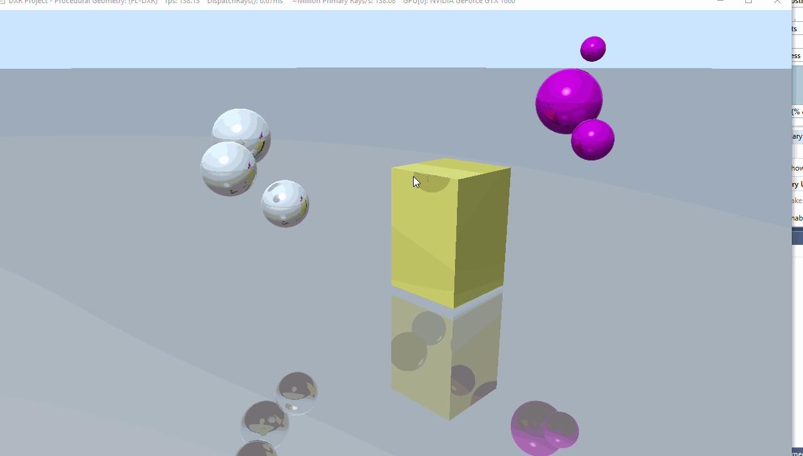
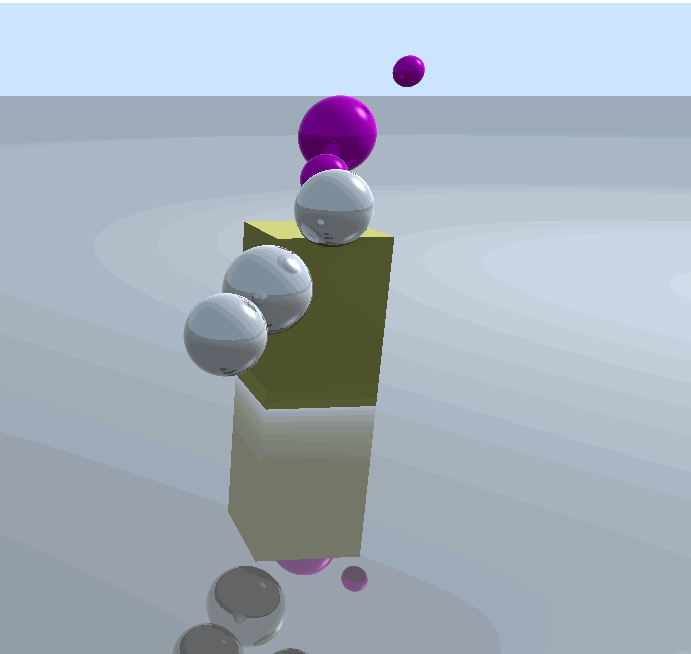
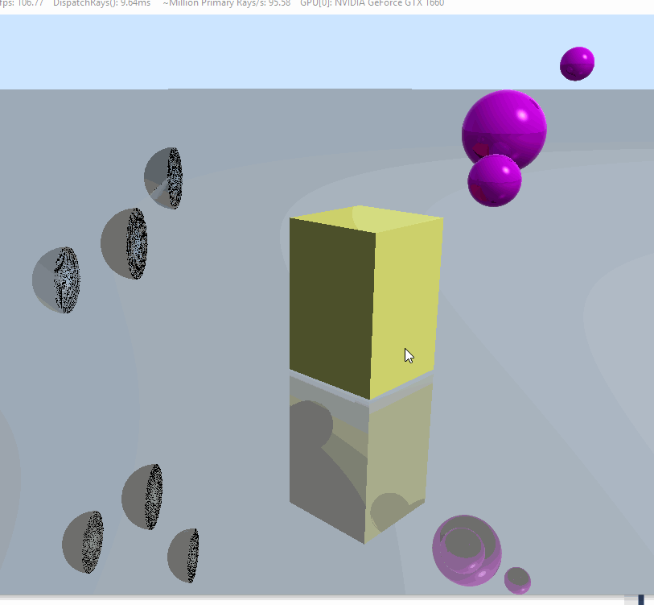

**University of Pennsylvania, CIS 565: GPU Programming and Architecture,
Project 5 - DirectX Procedural Raytracing**

* Eric Micallef
  * https://www.linkedin.com/in/eric-micallef-99291714b/
  
* Tested on: Windows 10, i5, Nvidia GTX1660 (Personal)

- [Overview](#Overview)
- [Performance Analysis](#Performance-Analysis)
- [Debilitating Bugs/Bloopers](#Debilitating-Bugs-AKA-Bloopers-In-CIS565-World)
- [References](#References)

# Overview

Special thanks to Ziad. He is probably sick of seeing me in his OH and on Piazza. Without him I would have thrown my desktop out the window.

In this project we used DirectX12 to implement a basic path tracer. In this homework we were asked to implement the CPU side of DirectX12  as well as the GPU logic of raytracing in DirectX12. Below you will see some animations of the ray tracer in motion.

# Performance Analysis

Below are some data points after manipulating the recursion depth. As you can see, the further we follow the ray slower our application becomes. I also did not see any noticeable rendering difference with these increasing recursion depths.

# Debilitating Bugs AKA Bloopers In CIS565 World

After watching my program crash 10000000000000000000 times because my cpu side was wrong, finally I got something up... but then I had to sadly go back and fix alot of stuff ... 

turns out there was alot wrong here ... alot ... But I do like the darker purple and darker yellow colors!

my lerping for fading was off.. way offf.... Lerping is not to be confused with the ever popular LARPing.

If you look you can see that the two purple balls move in a very odd manner. was kind of neat.

problem was my logic for keeping track of closet hit was a bit off. I was keeping track of tmax, a sensical person would have looked at the function return and saw it was evaluating thit... I became sensical after about 2 hours of debugging.

This is what happens when you accidentally return a float instead of float3 ): 

# References

Ziad ... without him I would have thrown my computer out the window

http://viclw17.github.io/2018/11/29/raymarching-algorithm/

https://www.freecodecamp.org/news/understanding-linear-interpolation-in-ui-animations-74701eb9957c/	

https://www.scratchapixel.com/lessons/3d-basic-rendering/minimal-ray-tracer-rendering-simple-shapes/ray-sphere-intersection

https://www.scratchapixel.com/lessons/3d-basic-rendering/minimal-ray-tracer-rendering-simple-shapes/ray-box-intersection

https://www.scratchapixel.com/lessons/3d-basic-rendering/phong-shader-BRDF

https://www.scratchapixel.com/lessons/advanced-rendering/rendering-distance-fields/blobbies

