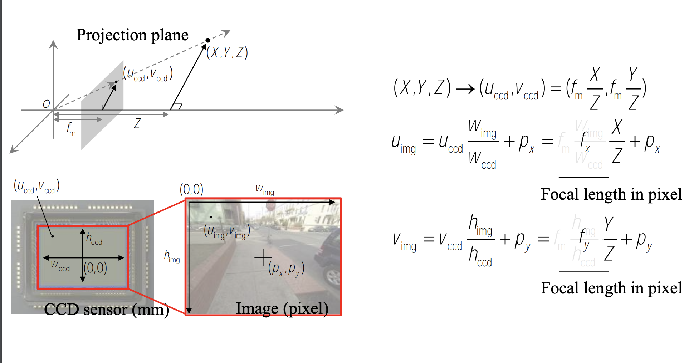
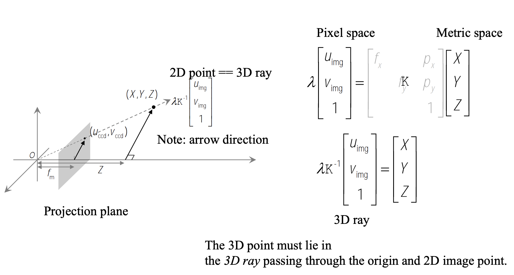
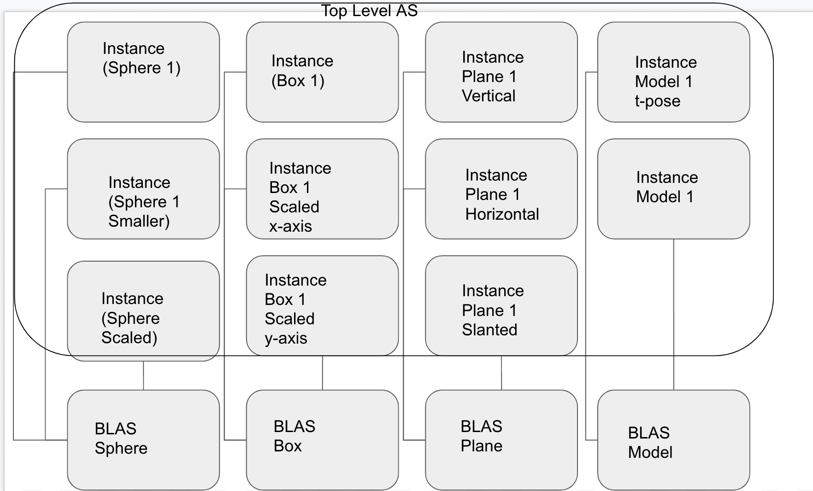

**University of Pennsylvania, CIS 565: GPU Programming and Architecture,
Project 5 - DirectX Procedural Raytracing**

* Srinath Rajagopalan
* [LinkedIn](https://www.linkedin.com/in/srinath-rajagopalan-07a43155/)

### DirectX Raytracing

1) _Ray tracing begins by firing off rays from the camera's perspective, with 1 ray corresponding to 1 pixel. Say the viewport is (1280 by 720), how would you convert these pixel locations into rays, with each ray being defined by an Origin and a Direction, such that Ray = Origin + t * Direction? Consult this intro to camera transformations and this explanation of world-to-screen/screen-to-world space article to formulate an answer in your own words_

We have to to generate rays for each pixel. Given a `WxH` image, for each pixel coordinates `(i,j)`, we shoot a ray through the center of the pixel. So it boils to finding the direction between `(c_x, c_y, c_z)` (coordinates of the camera) and `(x, y, z)`, coordinates of our pixel center on the image corresponding to pixel center `(i,j)` in the world frame. First we get the absolute coordinates of the pixel center of `(i,j)`. If top left of the screen is `(0,0)`, coordinates of `(i,j)` is `u_img = w*i + w/2` and `v_img = h*j + h/2` where `(w,h)` are the width and height of each pixel. From this we can use the camera calibration matrix to transform `(u_img, v_img)` to `(x, y, z)`. This is done as follows (using slides from [CIS: 581](https://alliance.seas.upenn.edu/~cis581/Lectures/Fall2019/cis581-02-2019-projection-simple.pdf)).

	

	

Once we have the camera calibration matrix `K` which is `3x3`, we invert it, and multiply with `(u_img, v_img, 1)` we derived above for the pixel coordinates `(i,j)`. From this we get `(X, Y, Z)` which is the _direction_ of the ray. Adding with `(c_x, c_y, c_z)` gives us the ray equation. Changing the value of `lambda` gives us different points on the ray. We do this for every pixel in the `WxH` image. This is under the assumption that, image is on the X-Y plane and camera is aligned with the Z-dimension. If in the world coordinates, the camera is aligned at a different angle, we also have to consider rotation.

2) _Each procedural geometry can be defined using 3 things: the Axis-Aligned Bounding Box (AABB) (e.g. bottom left corner at (-1,-1,-1) and top right corner at (1,1,1)) that surrounds it, the Type (e.g. Sphere) of the procedural geometry contained within the AABB, and an Equation describing the procedural geometry (e.g. Sphere: (x - center)^2 = r^2). Using these 3 constructs, conceptually explain how one could go about rendering the procedural geometry. To be specific, consider how to proceed when a ray enters the AABB of the procedural geometry_

Using the AABB of the object, we can check whether a given ray  collides with the AABB or not. If it does, we use the type of the geometry to determine the corresponding intersection shader which uses the ray equation and the equation of the geometry to determine if it's a hit or miss. If it's a hit, we color the ray with the color of the object, compute the normal to the surface, and generate another ray to the available light source. If this newly generated ray collides with any object in between, then it is treated as a shadow ray.

3) _Draw a diagram of the DXR Top-Level/Bottom-Level Acceleration Structures of the following scene. Refer to section 2.6 below for an explanation of DXR Acceleration Structures. We require that you limit your answer to 1 TLAS. You may use multiple BLASes, but you must define the Geometry contained within each BLAS_

	

