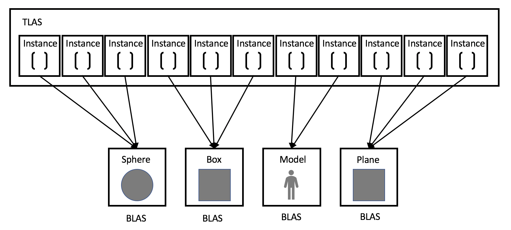

**University of Pennsylvania, CIS 565: GPU Programming and Architecture,
Project 5 - DirectX Procedural Raytracing**

* Grace Gilbert
  * https://www.linkedin.com/in/grace-gilbert-2493a0156, http://gracelgilbert.com
* Tested on: Windows 10, i9-9900K @ 3.60GHz 64GB, GeForce RTX 2080 40860MB


<p align="center">
  
</p>

# Overview
In this project, I made a real-time raytracer using a DirectX Raytracing rendering pipeline.  The raytracer can render triangulated mesh objects, used for the ground plane, analytic procedural geoemtries, including spheres and boxes, and volumetric procedural geometry, metaballs.  These objects are rendered shaded with Phong reflection combined with Schlick's approximation of fresnel reflection. 

# Resources
- DirectX documentation: https://microsoft.github.io/DirectX-Specs/d3d/Raytracing.html
- Phong reflection model: https://en.wikipedia.org/wiki/Phong_reflection_model
- Schlick's approximation: https://en.wikipedia.org/wiki/Schlick%27s_approximation

# Implementation
## CPU Setup
In order to perform DirectX raytracing on the GPU, we must first send all of the necessary data to the GPU.  This data is prepared and sent from the CPU.
### Passing Data
To pass data to the GPU, we have to populate buffers with the data to be passed, and then map the data to a region in memory that the GPU can read.  This is accomplished with the GpuUploadBuffer struct.  There are two types of buffers, a constant buffer and a structured buffer.  

A constant buffer is a buffer that can hold a single struct.  We use constant buffers to store the scene data, which includes the lights, camera projections, and elapsed time. We also store material data for the proceudral geometry as well as other meta data in constant buffers.

A structured buffer can hold multiple structs, behaving like an array of constant buffers.  We use structured buffers to store transforms for procedural geometry, triangle position data.  

Once we have the buffers set up, we need to tell the GPU how to access and read the data we passed. We use root signatures to do this. Root signatures can be global, accessed by any defined GPU function, or local, only accessible in some shaders. Root signatures act as a descriptor of a type of resource.  We use three different types of descriptors: ConstantBufferView, ShaderResourceView, and UniformAccessView.  We can tell the GPU where to store the root signature, and then can provide information about the data it represents and how to read it. 

We now have the data passed to a place accessible by the GPU, and a description for how that data should be read on the GPU.  Later in the pipeline, when we finally dispatch the raytracing call, we establish a link between this data and the instructions for how to read the data, completing the data transfer process.

### Geometry
An important part of raytracing is setting up the geometry that will be displayed on screen.  The first part of setting up the geometry is to set up the hit groups. A hit group specifies the closest hit shader, any hit shader (which we do not use), and the intersection shader (required for all geometry except triangles).  Depending on the type of geometry, we want to apply differnet shaders.  For example, the closest hit shader of a triangle geometry differs from that of a procedural geometry, so we want to specify this to ensure that the GPU uses the right hit groups for each geometry.

We also need to pass in the geometry position and transformation data so the GPU knows where to draw the geometry.  For triangles, this is the vertex positions and the indices that represent the triangles.  For procedural geometry, we must pass in the type of procedural geometry and the axis aligned bounding box (AABB), as well as the transformation of the geometry to its position in the scene. There are two types of procedual geoemtry, volumetric and analytic, and this will change how intersections with the geometry are calcualted.   

The final step in passing the geometry data to the GPU is organizing it in acceleration structures. The raytracing process is expensive, so organizing the geometry into acceleration structures can speed up performance. DXR has built in acceleration structure generation, we just need to pass in the data in the correct way. The acceleration structure consists of Top Level Acceleration Structures (TLAS), and Bottom Level Acceleration Structures (BLAS). The BLAS holds geometry data, and the TLAS holds instances of a BLAS. For example, a BLAS can hold data that represent a sphere, and a TLAS can have multiple instances of that BLAS, each with different transformations, materials, and other properties describing that sphere. 

In our project, we have two BLAS's. One BLAS contains triangle data, and the other holds all of the procedural data, meaning the sphere, box, and metaball data. We then have one TLAS that contains one instance of a triangle BLAS and one instance of the procedural BLAS.

### Dispatch
Once we have all of the data set up and passed to the GPU, which now knows how to read in that data, we can finally dispatch our rays to begin the raytracing process. This is where we bind our buffers to the root signatures we created, connecting the data we passed to the instructions we gave to read that data. After all the linking is set, we can call DispatchRays, which dispatches one thread per pixel, where each thread performs the calculations of one ray.

## GPU Raytracing
### Ray Generation
#### Radiance Rays
#### Shadow Rays
### Geometry
#### Triangles
Triangle intersection is built into DXR, so we do not need to implement a triangle intersection shader of our own. For the closest hit shader, we trace a shadow ray towards the light to see if the current point on the triangle is in shadow.  We also trace a reflection ray using Snell's law, applying Schlick's approximation for Fresnel reflection to the reflected color. 
#### Box
#### Sphere
#### Metaballs
### Shading
#### Phong Lighting
#### Fresnel Reflections with Schlick's Approximation
### Distance Falloff

## Concept Questions
1. Ray tracing begins by firing off rays from the camera's perspective, with 1 ray corresponding to 1 pixel. Say the viewport is (1280 by 720), **how would you convert these pixel locations into rays**, with each ray being defined by an `Origin` and a `Direction`, such that `Ray = Origin + t * Direction`? Consult this [intro](https://www.scratchapixel.com/lessons/3d-basic-rendering/computing-pixel-coordinates-of-3d-point/mathematics-computing-2d-coordinates-of-3d-points) to camera transformations and this [explanation](http://webglfactory.blogspot.com/2011/05/how-to-convert-world-to-screen.html) of world-to-screen/screen-to-world space article to formulate an answer in your own words.

To convert the pixel locations into rays, we start by setting the origin of the ray to the camera's eye position, as we are casting rays from our camera. 

To find the direction of the ray, we must find the pixel's world space position given its pixel space position. This process is the inverse of the process we use to convert world space positions into screen pixel positions. Say our pixel position is (x, y). The first step is taking the pixels from pixel space to homogenized screen space:
```
homogenizedScreenX = 2 * (pixelX / screenWidth) - 1
homogenizedScreenY = 1 - 2 * (pixelY / screenHeight)
```
Next we want to transform our homogenized screen space point into unhomogenized screen spcae. In the reverse direction, to get from unhomogenized to homogenized, we divide all coordinates by the depth of the point from the camera, so now we need to multiply by this depth. To do this, we will need a z value, as z represents depth. We will set this z value to 1.  This is because we know that a z value of 1 in homogenized screen space corresponds to the far clip plane, a known camera value. Therefore, to convert our homgenized screen space point into unhomogenized space, we multiply the 3D point (homogenizedScreenX. homogenizedScreenY, 1) by the far clip plane depth:
```
unhomgenizedSceenSpace = (homogenizedScreenX, homogenizedScreenY, 1) * farclip
```
Note that here I chose the depth of the point to be the far clip plane. Because we are ultimately finding the direction from the camera to this point and there are infinitely many positions along this direction, it's depth does not actually matter, as we will normalize the direction anyways. Therefore, I choose the far clip plane as this is a known value, making the calculation simpler.

The final step is to transform the unhomogenized screen space point by the inverse of the view projection matrix, which will bring it back into world space from screen and camera space. The inverse projection brings it back to camera space, and the inverse view matrix brings it to world space. Our transformation matrix looks like the following:
```
viewProjInverse = inverse(projMatrix * viewMatrix)
```
Our final world space position is the following:
```
worldSpacePoint = viewProjInverse * vec4(unhomogenizedScreenSpace, 1)
```
Note the extra 1 is because the inverse view projection matrix is a 4x4 matrix, so we must make the point a vec4. We choose 1 as the fourth coordinates as 1 allows the point to be translated in the transformation.

Also note that in the implementation in the assignment, instead of performing the unhomogenization stage, we get our world space positions by transforming  (homogenizedScreenX, homogenizedScreenY, 0, 1) by a projection to world transformation matrix:
```
worldSpacePoint = projectionToWorld * vec4(homogenizedScreenX, homogenizedScreenY, 0, 1)
```

Now that we have the pixel's position in world space, we can find the ray diretion by finding the direction between the camera eye and the world space position:
```
origin = cameraEye
direction = normalize(worldSpacePoint - cameraEye)
```

2. Each procedural geometry can be defined using 3 things: the `Axis-Aligned Bounding Box` (AABB) (e.g. bottom left corner at (-1,-1,-1) and top right corner at (1,1,1)) that surrounds it, the `Type` (e.g. Sphere) of the procedural geometry contained within the AABB, and an `Equation` describing the procedural geometry (e.g. Sphere: `(x - center)^2 = r^2`). **Using these 3 constructs, conceptually explain how one could go about rendering the procedural geometry**. To be specific, consider how to proceed when a ray enters the AABB of the procedural geometry.

The first step will be to see if a ray has any chance of hitting the geometry. We check this by seeing if the ray intersects with the geometry's AABB. If not, we know there is no intersection. If it does hit the AABB, we then must check if the ray intersects the object. To do this, we first must get the type of geometry we are testing intersection with. The geometry's type determines the equation the describes it, and this equation is needed for intersection testing.

Once we have this equation, we can use it to find the intersection with our geometry.  For analytic geometry, we know the equation of geometry and the equation of a point along a ray (x = rayOrigin + t * rayDirection). We can equate these two equations and solve for the position that is both on the ray and on the surface.  If there is no valid solution to this, we know that the ray missed the object.

For volumetric geometry, for example the metaballs, we can use raymarching. In ray marching, we start at a point a certain distance along our ray and make small steps along the ray until hitting the object or missing it. The starting position is the position where our ray intersected the boudning box, as this is the farthest point along the ray that we know is not already past our geometry. We can use the equation for the metaballs to see if our current point evaluates to something that exceeds the threshold of being in the metaball. While we are outside the geometry, we continue to step forward along the ray in small steps. As soon as we go from being outside to inside, we know that the intersection occured between the current position and the position before the last step. If we never find our ray inside the geometry, it means there is no intersection. Of course we cannot infinitely ray march our ray to find that it never is inside, but we can see if it leaves the AABB without hitting the geometry. Once our ray is outside the AABB, if it has not yet hit the geometry, it never will and we can return no intersection.

3. **Draw a diagram of the DXR Top-Level/Bottom-Level Acceleration Structures** of the following scene. Refer to section 2.6 below for an explanation of DXR Acceleration Structures. We require that you limit your answer to 1 TLAS. You may use multiple BLASes, but you must define the Geometry contained within each BLAS.



Each type of geometry, sphere, box, model, and plane, has its own BLAS, and then each instance of geometry has an instance in the TLAS that points to the type of geometry that it is. The instance would store the transformation of the geometry, the color, and the pose if it is a type of geometry that has a pose, as well as any other descriptive information about that instance of the geometry.


