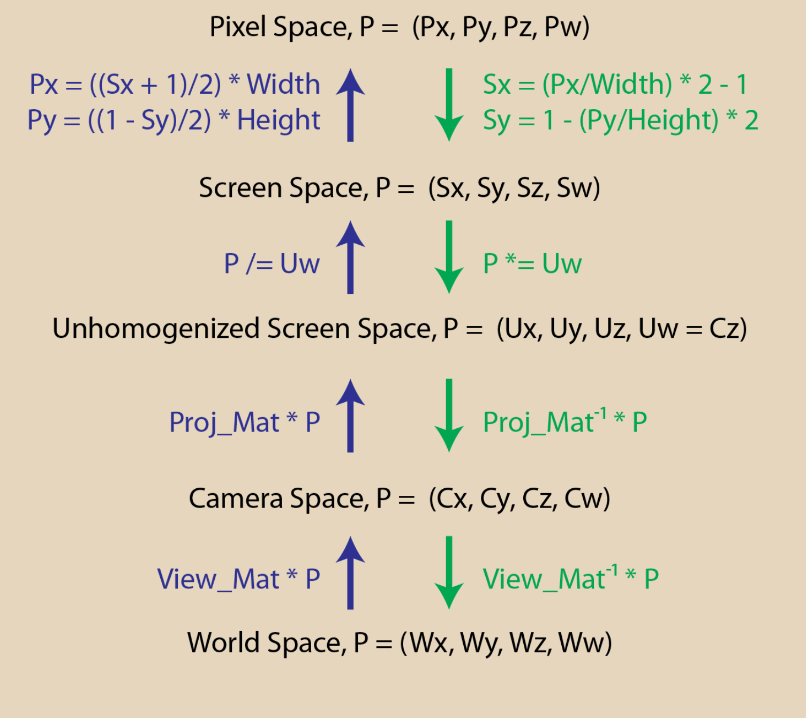
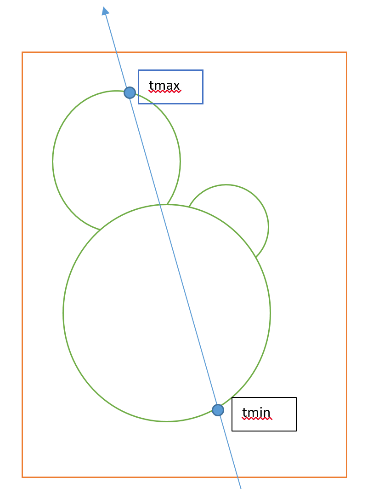
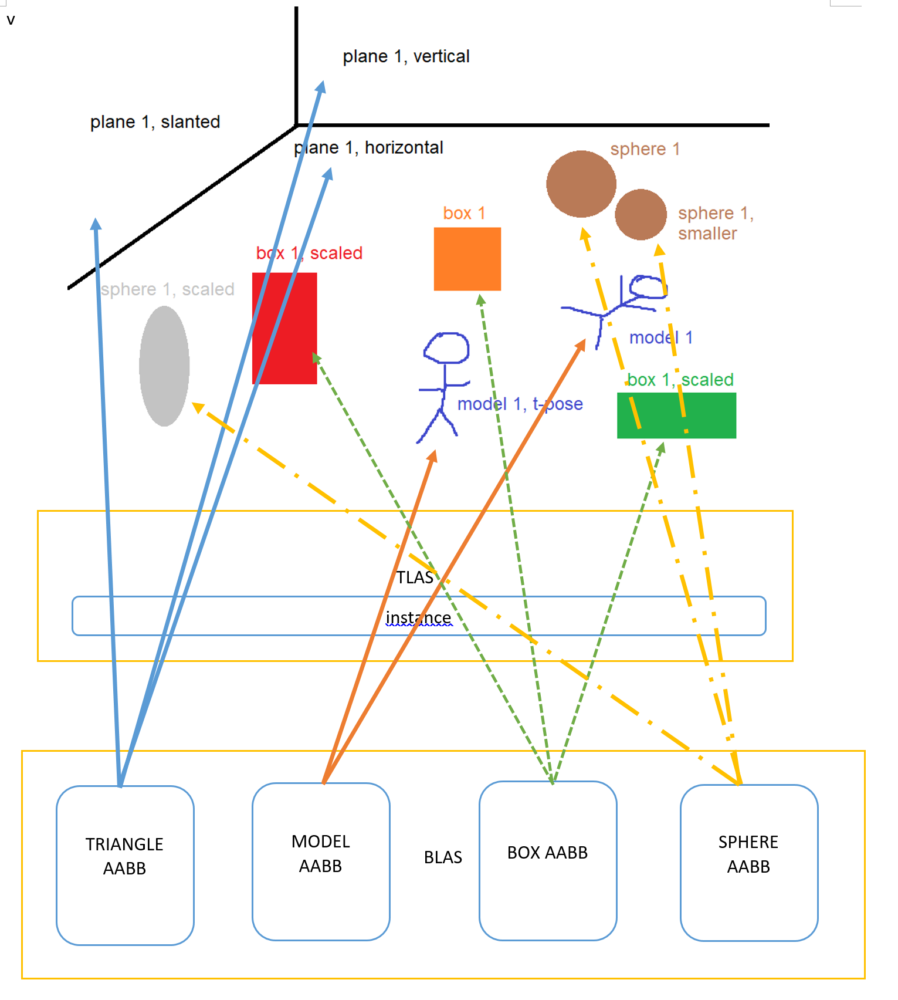

Q1：

Hi, we need to the opposite path of rasterization. In the general path, a point in 3D will face these transformations:

`World space->Camera space->Screen space->NDC->Pixel Space`

So what we do is just get point from pixel space and transform it to the world space.

origin is the `3d camera position,` 

and the direction is `point pos(world space) - camera pos(world space)`

Q2：

`Ray = Origin + t * Direction` 

Ray marching is the good way to render objects. When entering the AABB bounding box of the sphere, we can get the nearest point through the procedural sphere equation.  That's the distance we can move forward, after moving some steps, the distance between the end point is enough near to the rendering object, then we can render it. Based on the specific objects, calculate the normal and then get the color.

  

If we want to render the meta ball, get the tmin and tmax,  we separate the tmin->tmax for several parts, each parts,  calculate the protential(forget the name of it) for each circle, this value is 1 at the center decrease along the radius, and 0 at the edge and outside the circle. Sum the value for 3 circle, and if the sum is larger than the manually set threshold, then render this point. 

Q3：

1 TLAS, 4 BLASes,

one BLAS for: sphere AABB, Geometry: sphere1 scaled, sphere1, sphere1 smaller

one BLAS for: box AABB,  Geometry: box1, box1 scaled yellow, box1 scaled green

one BLAS for model AABB,  Geometry：model1 T-pose, model1

one BLAS for triangle AABB,  Geometry： plane1 slanted, plane1 vertical, plane1 horizontal