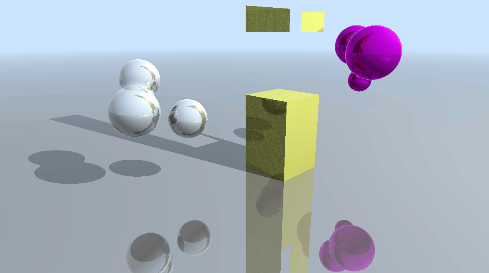
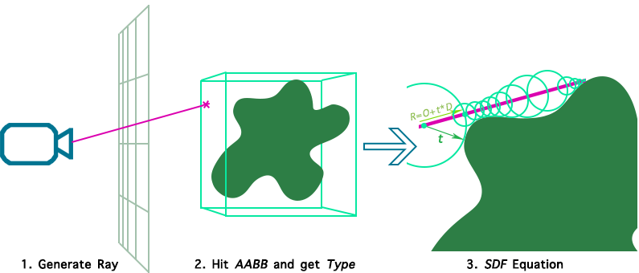
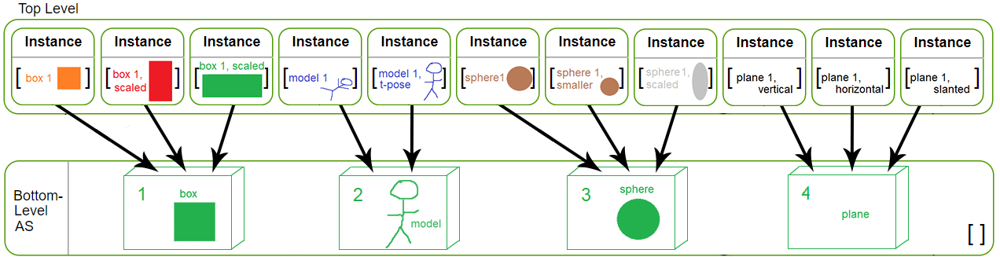
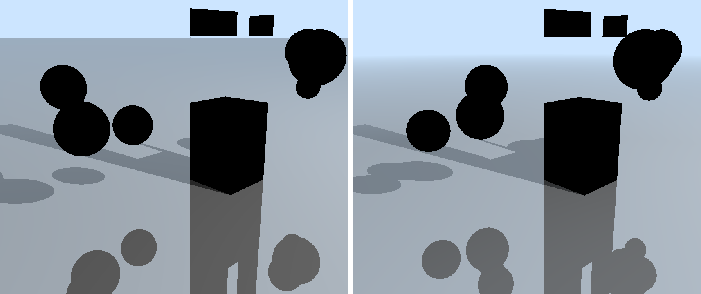

**University of Pennsylvania, CIS 565: GPU Programming and Architecture,
Project 5 - DirectX Procedural Raytracing**

* Alexis Ward
  * [LinkedIn](https://www.linkedin.com/in/alexis-ward47/), [personal website](https://www.alexis-ward.tech/)
* Tested on: Windows 10, i7-8750H CPU @ 2.20GHz 16GB, GTX 1050 Ti 

# Ray Tracing Background (Conceptual Questions)

### How To Ray Trace

Ray tracing begins by firing off "rays" from the camera's perspective, with 1 ray corresponding to 1 pixel. Each ray is defined by an `Origin` and a `Direction`, such that `Ray = Origin + t * Direction`, with `t` being a distance along the ray. You can convert each pixel in the display to a ray by:

1. Setting `Origin` equal to the camera's "eye," or position.
2. Given pixel coordinates `index`, we get it's Screen Space counterpart by:
  * `screenX = (index.x / ScreenXDimension) * 2.f - 1.f` and
  * `screenY = 1.f - (index.y / ScreenYDimension) * 2.f`
3. Since we don't have a `z` or `w` value, we estimate the furthest possible point by using the camera's far-clip distance: `farPoint = vec4(screenX * -farClip, screenY * -farClip, farClip, farClip)`. This puts us into Unhomogenized Screen Space.
4. We now multiply this vector by the inverse of the camera's view and projection matrices: `inverse(u_View) * inverse(u_Project) * farPoint`
5. Set the `Direction` to the normalized difference between the above result and the `Origin`.

This is essentially converting a pervieved point in Pixel Space back to World Space, and then finding the vector from the camera to said point. We can now test for the ray's intersections with geometry.

DirectX Update: Multiplication is swapped by virtue of DirectX's wonkiness.

### Locating Procedural Geometry

Every procedural geometry in this project is defined using 3 things: its `Axis-Aligned Bounding Box` (shortened to AABB, it is a tight bounds that encases the whole shape), its `Type` or shape, and the `Equation` determined by its `Type` and transformation. This `Equation` will most likely be a signed distance function, which tells us how far we are from the closest point on the geometry (but not necessarily the closest point along a ray).

Update: No SDFs in this project, but the process is similar nonetheless. 

To render procedural geometry, we check each pixel's corresponding ray for intersections with the scene. To simplify this, we can first see if the current ray passes through an `AABB` stored within our Bottom Level Acceleration Structure (BLAS). This tells us that the geometry encased within can potentially influence this pixel. We then use a Closest Hit Shader determined by the object's `Type` to trace our ray with the influence of this geometry's `Equation`. This equation should give us a `t` value, as shown in the aforementioned ray representation: `Ray = Origin + t * Direction`. We displace our ray by this value and test again. This part happens recursively until the `Equation` returns a zero (or a value within some epsilon factor), or if the ray leaves the `AABB`.

This method greatly decreases runtime because, by working with only the intersected AABBs, we avoid having to recursively compare the ray to every geometry equation equation in the scene: we only perform this for the relevant equations. The AABB intersection check is a simple one because of how they are defined by their min and max [x, y, z] positions. 

### DXR Top-Level / Bottom-Level Example

Say our scene looks like this:

  

This is a diagram of the resulting acceleration structure:

# The Project

## The CPU Side
This project would not run without a complete CPU implementation, so unfortunately I have no visuals to display here. The general setup process goes as follows:

 - Allocating and uploadng **scene data** to the GPU, which includes a camera, lights, colors for objects, as well as transforms for the objects to render. I use `GpuUploadBuffers` to accomplish this.
 - Set up **root signatures** as a way to programmatically read/write to various data from the GPU. You first create a slot for the present resource and a descriptor that tells the GPU how to read said resource. The two are linked later in the process.
 - Create the **HitGroup** subobjects that will be built into the pipeline. A hit group, in this project, is composed of a `Closest Hit Shader` and at least one `Intersection Shader`.
 - Allocating and uploading the **geometry data**. This is done in two different ways: by triangle data and by procedural geometry data (AABBs).
 - Creating an **acceleration structure** to boost performance. The scene is divided into `Top Level Acceleration Structures` (TLAS) that hold multiple instances of `Bottom Level Acceleration Structures` (BLAS0, as visualized in the example above)
 - DXR's **Shader Tables**. Again, `GpuUploadBuffers`, and this version holds shaders of the same types.
 - Finally, we "glue" all this data together using the many `Set...()` functions available. Then `DispatchRays()` can be calleld for each pixel, like a CUDA kernel.

## The GPU Side

First we have to generate the rays as described in the **How To Ray Trace** section above. This will show a dark image like the one below, that only depicts ambient lighting.

  

### Trace Ray

DXR's TraceRay function, as the name implies, traces a ray through the scene. One implementation occurs for the radiance ray and another for the shadow ray. This is what the scene looks like with and without the shadow processing:

### Shaders

Miss Shaders and Intersection Shaders pull the scene together. They determine what happens when a ray hits or misses geometry and calculates essential information like the hit points and normals. In this project, I allow for intersections with spheres and metaballs (left and right below).

### Shading
This project uses the Phone Lighting Model for all objects. There is also a distance falloff that "blurs" geometry the further away they are - though, this is closer to atmospheric perspective. View the before and aafter below:

## Interesting bugs
I sadly have some visual artifacts when it comes to the box AABB. This includes extra geometry and spotty shading. I hope to fix this in the future.

I noticed that the calls to DirectX's `TraceRay()` function cuts my frame rate down by two thirds. I wasn't yet sure if that's just what happens with `TraceRay()`, or if it's somehow related to the aforementioned artifacts or improper buffer handling. To be determined!

## Performance Analysis

As expected, the frame rate goes down with increased ray depth (with few exceptions).