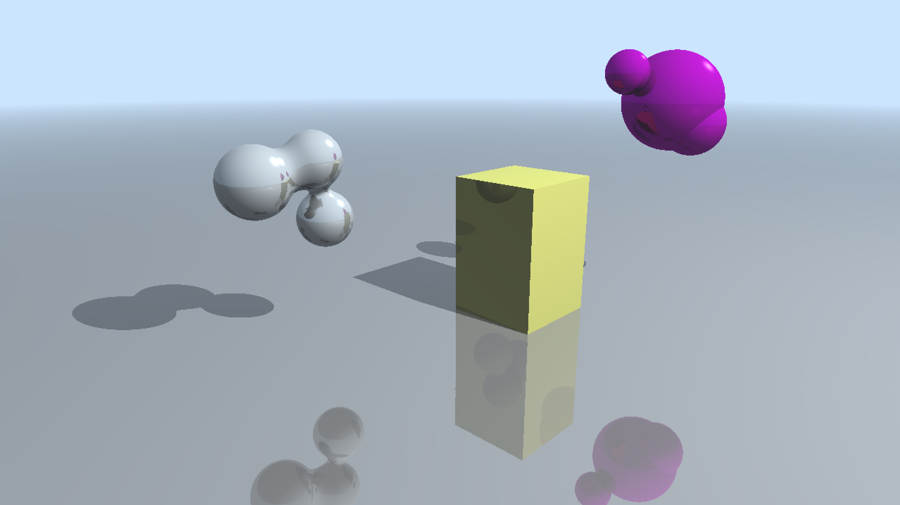
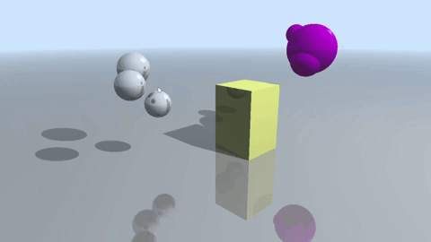
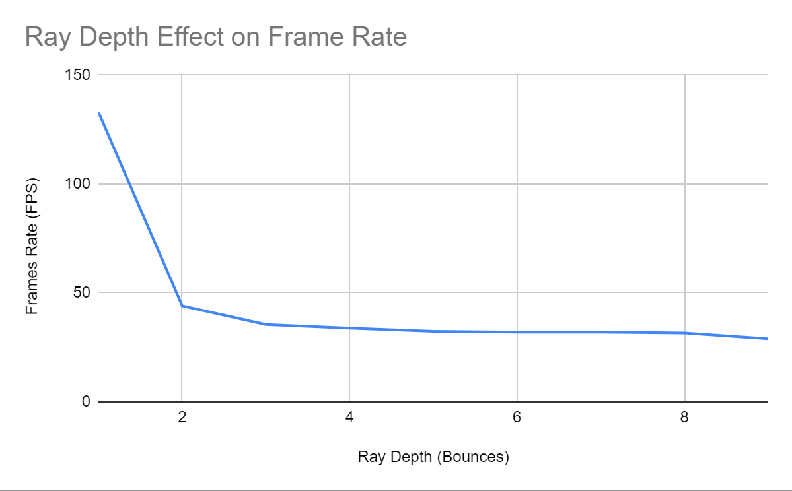

**University of Pennsylvania, CIS 565: GPU Programming and Architecture,
Project 5 - DirectX Procedural Raytracing**

* Joshua Nadel
  * https://www.linkedin.com/in/joshua-nadel-379382136/, http://www.joshnadel.com/
* Tested on: Windows 10, i7-6700HQ @ 2.60GHz 16GB, GTX 970M (Personal laptop)

This project implements a GPU-parallelized raytracer using the DirectX Raytracing API. The raytracer can render triangle, box, sphere, and metaball primitives. It supports a phong shading model with a raytraced reflective component, atmospheric perspective fog, and raytraced shadows.

As the number of bounces each ray is allowed to make increases, the FPS of the raytracer decreases. The severity of this decrease lessens as more bounces are allowed. This is because after each bounce, some of the remaining rays miss and are no longer available for tracing. So, the cost of allowing rays to continue bouncing decreases as more and more exit the scene.