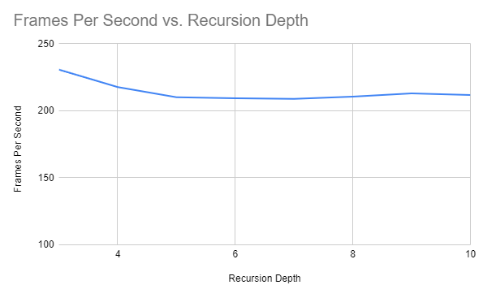
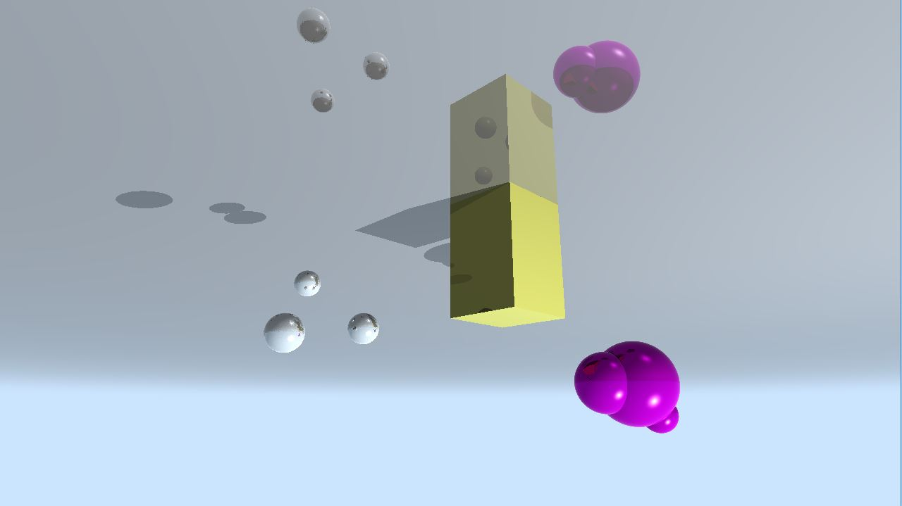
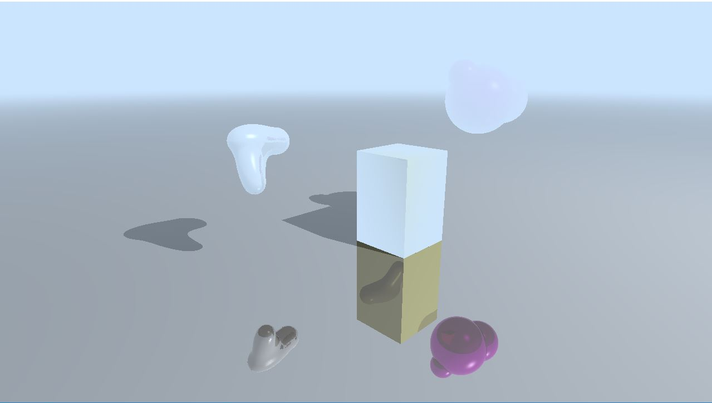
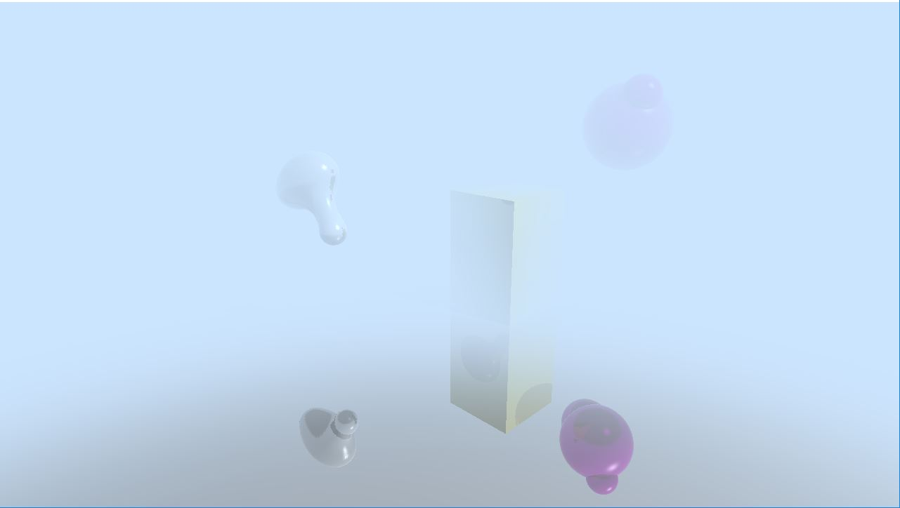

**University of Pennsylvania, CIS 565: GPU Programming and Architecture,
Project 5 - DirectX Procedural Raytracing**

* Saket Karve
  * [LinkedIn](https://www.linkedin.com/in/saket-karve-43930511b/), [twitter](), etc.
* Tested on:  Windows 10, Intel(R) Core(TM) i7-6700 CPU @ 3.40GHz 16GB, NVIDIA Titan V (SIGLAB)

### Highlights

### Contents

- Ray Tracing
- Outputs
- Performance Analysis
- Bloopers

### Ray Tracing

ray tracing is a process similar to path tracing, except that it is deterministic (no more probabilities!) and that we only do a single pass over the entire scene (no more multiple iterations). This image summarizes what goes on in ray tracing:

  

Specifically, the DXR execution pipeline mimics all the interactions depicted above. This diagram summarizes the DXR execution pipeline:

  

This does not prevent us from calling `TraceRay()` multiple times. In fact, any self-respecting raytracing project will allow multiple (~3) `TraceRay()` calls. The common denominator between ray and path tracing is the depth of the ray. In this project, we use a *minimum depth of 3* to allow tracing the following:

1. a **primary (radiance) ray** generated from the camera
2. a **shadow ray** just in case the ray hits a geometry on its way to the light source
3. a **reflection** ray in case the material of the object is reflective

Therefore, the lifecycle of a single ray can be thought of as follows:

1. generate a ray, see if it hits something
2. if it hits something, then attempt to *light/color* it
    * attempting to color that hit point is equivalent to **tracing that ray towards the light source**. 
    * if that ray hits *another* object on its way to the light, then the region is effectively shadowed
    * if not, then we successfully colored that point
3. if at any point we hit a reflective material, then trace another ray in the reflected direction and repeat the process

### Outputs

After completing all parts of the assignment, following output was observed.

Adding a fourth sphere to the metaball produced this output.

Enabling lighting animation.

I tried using Sigmoid function to produce the blur effect for long distance objects. Following output was produced when a suffucient offset was used.

### Performance Analysis

The performance of the render was tested for different values of Recursion depth. Performance is measured in terms of frames per second of the render.

It can be seen from the figure that the performance decreases with increasing depth. This is because for every render, the ray is traced more number of times. However, after a certain depth, the performance more or less remains same since the ray will most probably bounce into a light source (radiance ray) or become a shadow ray.

### Bloopers

Incorrect conversion to normalized device coordinates. Produced an inverted image

Forgot to change the function producing blur effect for AABB and changed it only for triangles.

Sigmoid function for blur effect without any offset generated an image with a smoke/fog like effect

