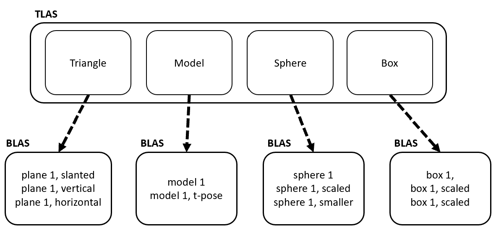

**University of Pennsylvania, CIS 565: GPU Programming and Architecture,
Project 5 - DirectX Procedural Raytracing**

* Zheyuan Xie
* Tested on: Windows 10 Pro, i7-7700HQ @ 2.80GHz, 16GB, GTX 1050 2GB (Dell XPS 15 9560)

## Conceptuel Questions
### Question 1: Generate Ray from Pixels
In ray tracing, a ray is generated for each pixel P'raster represented in raster space. The original and direction of the ray can be calculated by the following steps:

 1. Convert from raster space to NDC space. Note that the y coordinate is inverted since the origin of NDC space is located on the lower left corner.
 
 
 > P'NDC.x = (P'raster.x + 0.5) / PixelWidth

 > P'NDC.y = 1 - (P'raster.y + 0.5) / PixelHeight

 2. Convert from 2D NDC space to 2D screen space. 

 > P'screen.x =  (1 - 2 * P'NDC.x) * screenWidth

 > P'screen.y = (1 - 2 * P'NDC.y) * screenHeight

 3. Convert 2D screen space coordinate to 3D camera space gives the ray origin.

 > RayOrigin.x = P'screen.x

 > RayOrigin.y = P'screen.y

 > RayOrigin.z = - CameraToScreenDistance

 4. Calculate the direction of the ray. The camera orgin is (0,0,0) in the camera space.

 > RayDirection = normalize(RayOrigin - CameraOrigin)

### Question 2: Rendering Procedual Geometry

The procedural geometry is defined by:
 - An Axis-Aligned Bounding Box (AABB).
 - Geometry type.
 - Geometry equation.

The ray is first checked against the AABB. If there's an intersection (the ray enters the AABB at P0), it is then checked against the geomtry defined by its associated equation. We can use ray marching to advance the ray after it enters the AABB.

Calculate the samllest distance from P0 to all procedure shapes inside the AABB (using the equation), say it's d. If it is negative (or smaller than some threshold), we've found the intersection of the ray with the geometry. If not we advanced the ray by distance d to P1, calculate the smallest distance from P1 to the all procedure shapes in AABB, check if the distance is smaller than the threshold. We repeat this process until we hit or some maximum number of steps is reached.

### Question 3: DXR Acceleratin Structures
We can build 1 TLAS and 4 BLASs for the given scene:

