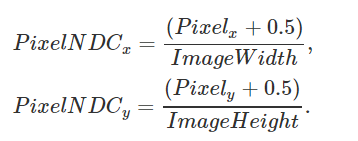
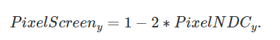
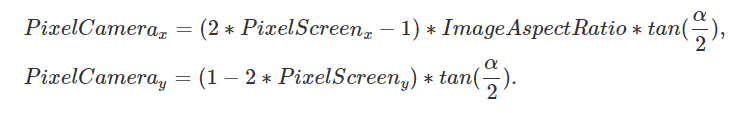

**University of Pennsylvania, CIS 565: GPU Programming and Architecture,
Project 5 - DirectX Procedural Raytracing**

* Gangzheng Tong
  * www.gtong.me
* Tested on: Windows 10, i7-8750H @ 2.20GHz 16GB, RTX 2070 8GB (personal laptop)

### Conceptual Questions

##### How to convert pixel locations into rays?

1. Given pixel coordinates (with range [0, height/width]), first cAonvert them into **Normalized Device Coordinate (NDC)** (with range [0, 1]). Note that we add a small shift (0.5) to the pixel position because we want the final camera ray to pass through the middle of the pixel. 



2. Map the NDC with range [0, -1] to **screen space** with range [-1, 1]

   

3. Account for image aspect ratio and field of view, we get the point in camera space

   

4. Because we don't really care about the z value for generating the ray, we can choose -1 for it. So we get the destination point **(p_x, p_y, -1)**

5. Apply the inverse of **world-to-camera (view) matrix** to the point, we get the point in world coordinate

6. Now we can calculate the ray with the origin (camera position) and destination because they all in world coordinate.

   ```Vec3f rayDirection = rayPWorld - rayOriginWorld; ```
   ```rayDirection.normalize()```

   

##### Conceptually how one could go about rendering the procedural geometry

1. We can traversal the acceleration structure and find the  `Axis-Aligned Bounding Box` (AABB) that has intersection with the ray
2. If we find the AABB, depending on what type of the geometry it contains, we can either look for an analytical solution such as solving for the ray-sphere intersection equation to get the intersection points, or use ray marching to find relatively close answers
3. Shade the closest intersection point and spawn new rays if desired


##### Diagram of DXR Top-Level/Bottom-Level Acceleration Structures


### Overview

...