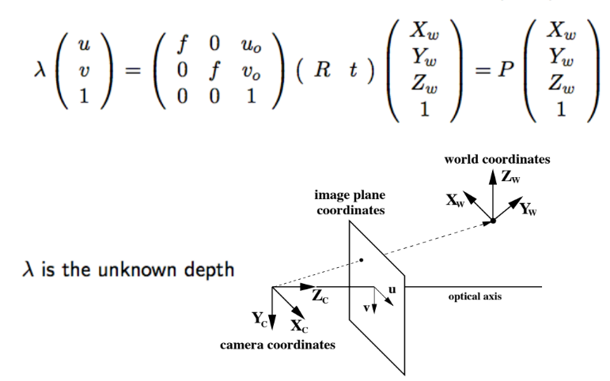
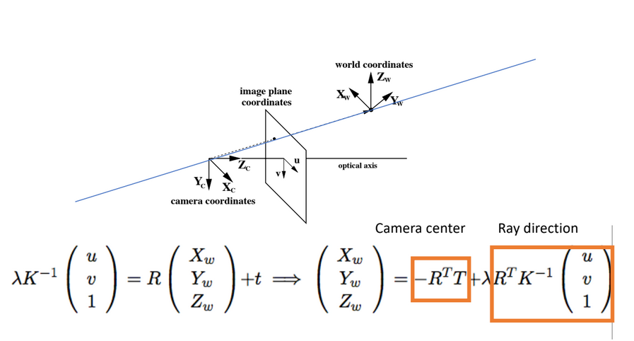
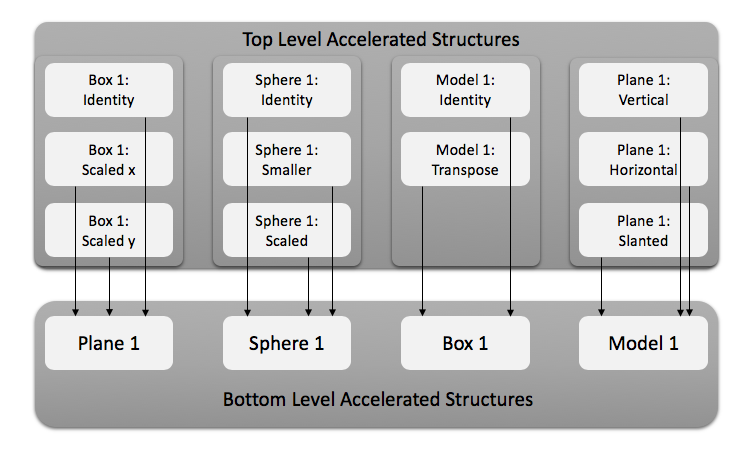

**University of Pennsylvania, CIS 565: GPU Programming and Architecture,
Project 5 - DirectX Procedural Raytracing**

* Author: Chhavi Sharma ([LinkedIn](https://www.linkedin.com/in/chhavi275/))
* Tested on: Windows 10, Intel Core(R) Core(TM) i7-6700 CPU @ 3.40GHz 16GB, 
             NVIDIA Quadro P1000 4GB (MOORE100B-06)

## Conceptual Questions

- 1. Ray tracing begins by firing off rays from the camera's perspective, with 1 ray corresponding to 1 pixel. Say the viewport is (1280 by 720), **how would you convert these pixel locations into rays**, with each ray being defined by an `Origin` and a `Direction`, such that `Ray = Origin + t * Direction`? Consult this [intro](https://www.scratchapixel.com/lessons/3d-basic-rendering/computing-pixel-coordinates-of-3d-point/mathematics-computing-2d-coordinates-of-3d-points) to camera transformations and this [explanation](http://webglfactory.blogspot.com/2011/05/how-to-convert-world-to-screen.html) of world-to-screen/screen-to-world space article to formulate an answer in your own words.

A ray shot from the camera center is assumed to pass through the center of each pixel (u,v) in the image frame/projection frame. The image/rendering frame is asumed to be parallel to the x-y plane of the camera lying unit distance away along the z direction (as shown in the image below). Given this setup, we can derive the relationship beween the pixel coordiates and the world coordinates.

  

From Perspetive Geometry, a point in the 3D world coordinate system can be convered into the pixel id as shown above. We first transform the point (Xw, Yw, Zw) from world coordinate system to camera coordinate system. (This would be applicable in cases where the camera is not at the origin). Once we have the point with respect to the camera, we use the camera instrinsic matrix [K] to convert the point to pixel space. 

Here, Xw, Yw, Zw are the world coordinate points. [R] an [t] are rotation and translation matrices that convert the world coordinate system to camera cordinate system(Xc, Yc, Zc). The camera intrinsics matrix [K] defines the camera properties such as focal length (fx, fy, 1) and the image offset in the x-y plane with respect to the camera coordinates. Lambda is the depth and [u] and [v] are the pixel coordinates.

This process can be inverted to get world coordinates based on a given depth, from pixel coordinates as follows.

  

In our case, if we assume that the camera is at the origin, (that is R is identity and T is zero), then we simply multiply the pixel coordinates by the inverted camera intrinsic matrix K and scale it by depth (lambda) to get the point in world coordinates. 

To define a ray from camera center, 
'''
Ray = Origin + t * Direction
'''
Here direction is the unit vector from camera center (Cx, Cy, Cz) to the point u,v in the image plane (u,v,1) unit distacne away from the camera, Origin is the origin of the camera, and t is the dpeth factor.

- 2. Each procedural geometry can be defined using 3 things: the `Axis-Aligned Bounding Box` (AABB) (e.g. bottom left corner at (-1,-1,-1) and top right corner at (1,1,1)) that surrounds it, the `Type` (e.g. Sphere) of the procedural geometry contained within the AABB, and an `Equation` describing the procedural geometry (e.g. Sphere: `(x - center)^2 = r^2`). **Using these 3 constructs, conceptually explain how one could go about rendering the procedural geometry**. To be specific, consider how to proceed when a ray enters the AABB of the procedural geometry.

To render procedural geometry, we compute the exact geomentry in real time based on the procedral equation. 
We first compute if a ray intersects the axis-aligned-bounding-box `AABB`, if not then it will never intersect any object within it. Once the raya enters the `AABB` geometry, based on the geometry `type` of the procedural geometry, the corrsponding shader will compute intersections. The shader wil call the `procedural geometry` equation for that `AABB` to compute intersections. For example in a metaball 'AABB', there may not be an intersection at all if there is no point in the rays direction above the potential threshold. If the `procedural geometry` equation returns an intersection, the shader will compute the normal at the intersection point and return this information.

- 3. **Draw a diagram of the DXR Top-Level/Bottom-Level Acceleration Structures** of the following scene. Refer to section 2.6 below for an explanation of DXR Acceleration Structures. We require that you limit your answer to 1 TLAS. You may use multiple BLASes, but you must define the Geometry contained within each BLAS.

  

  

