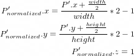
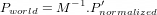
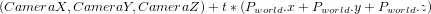
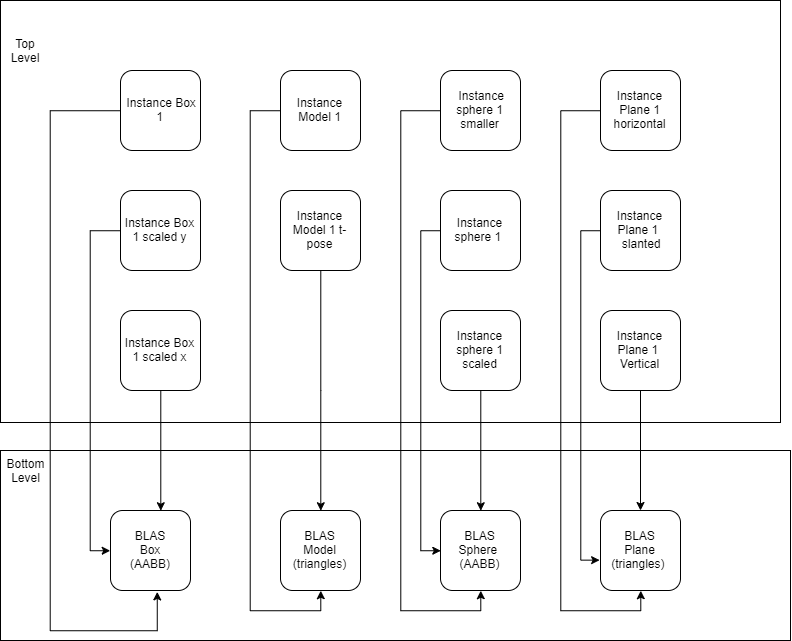

**University of Pennsylvania, CIS 565: GPU Programming and Architecture,
Project 5 - DirectX Procedural Raytracing**

* Dewang Sultania
  * [LinkedIn](https://www.linkedin.com/in/dewang-sultania/)
* Tested on: Windows 10, Intel Xeon E-2176M @ 2.70GHz 16GB, Quadro P2000 4GB (Personal Computer)

### Conceptual Questions

* Ray tracing begins by firing off rays from the camera's perspective, with 1 ray corresponding to 1 pixel. Say the viewport is (1280 by 720), **how would you convert these pixel locations into rays**, with each ray being defined by an `Origin` and a `Direction`, such that `Ray = Origin + t * Direction`? Consult this [intro](https://www.scratchapixel.com/lessons/3d-basic-rendering/computing-pixel-coordinates-of-3d-point/mathematics-computing-2d-coordinates-of-3d-points) to camera transformations and this [explanation](http://webglfactory.blogspot.com/2011/05/how-to-convert-world-to-screen.html) of world-to-screen/screen-to-world space article to formulate an answer in your own words.

  * Given pixel locations, we can remap to Normalized Device coordinates using the given equations, where height is 780 and width is 1280.

  * Using inverse of projection matrix M we convert the Normalized Device coordinates to world coordinates, we will do this for the pixel as well as the camera origin.

  *  Now we can find the equation of the ray using

    The Camera coordinates are obtained by using the same equation as stated in point 2 by using P normalized as [0,0,0]. The Matrix M is 4X4 so before multiplying we append a 1 at the end.
  
* Each procedural geometry can be defined using 3 things the Axis-Aligned Bounding Box (AABB) (e.g. bottom left corner at (-1,-1,-1) and top right corner at (1,1,1)) that surrounds it, the Type (e.g. Sphere) of the procedural geometry contained within the AABB, and an `Equation` describing the procedural geometry (e.g. Sphere: `(x - center)^2 = r^2`). **Using these 3 constructs, conceptually explain how one could go about rendering the procedural geometry**. To be specific, consider how to proceed when a ray enters the AABB of the procedural geometry.

  * For rendering procedural geometry we will have to shoot rays from each pixel in the camera and then to determine if the ray hits any object, we will make collision checks with Axis Aligned bounding box of each object. When a ray enters the bounding box with a particular geometry, the geometry type will determine which intersection shader we need to use to find if the ray had hit. The shader contains an equation for the object it contains and setting it equal to the equation of the ray will tell us if there was a hit or a miss. On hit, we color the ray and return the intersection point and normal. Then they are rendered and it is determined if there is a direct view or if the ray is shadowed. 

* Draw a diagram of the DXR Top-Level/Bottom-Level Acceleration Structures** of the following scene. Refer to section 2.6 below for an explanation of DXR Acceleration Structures. We require that you limit your answer to 1 TLAS. You may use multiple BLASes, but you must define the Geometry contained within each BLAS.

  * 
