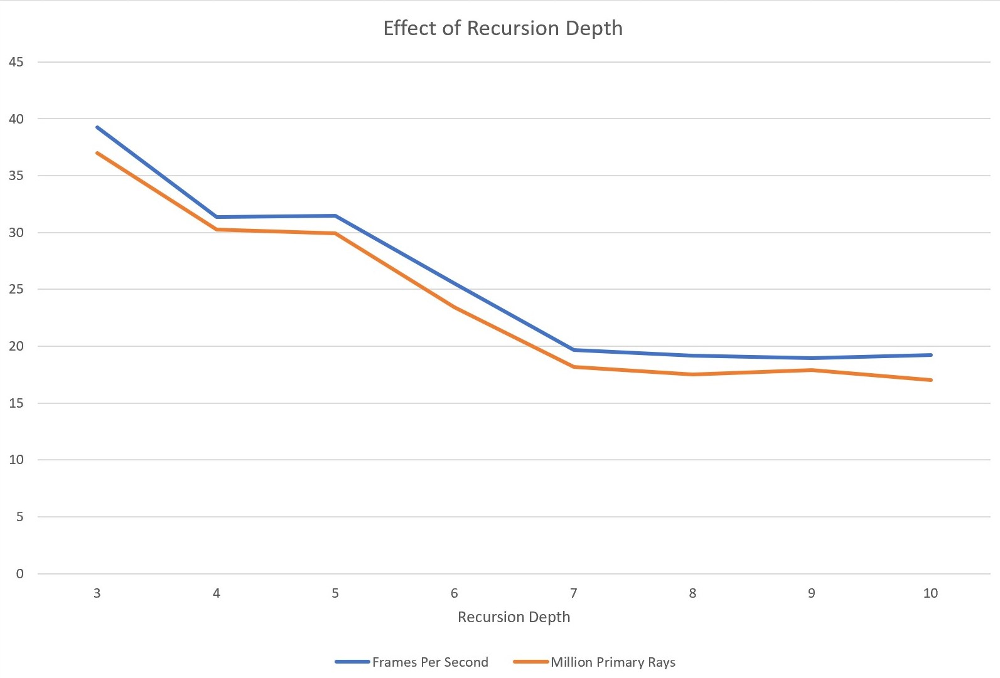

**University of Pennsylvania, CIS 565: GPU Programming and Architecture,
Project 5 - DirectX Procedural Raytracing**

* Author : Kushagra
  * [LinkedIn](https://www.linkedin.com/in/kushagragoel/)
* Tested on : Windows 10, i7-9750H CPU @ 2.60GHz 16GB, GTX 1650 4GB (Personal Computer)

DirectX Procedural Raytracing
============================

## Table of Contents  

1. [Introduction to Ray Tracing](#intro)  
2. [Features](#features)  
2.1. [Real Time Ray Tracing using DXR](#dxr)  
2.2. [Procedural Geometry](#pro)  
2.3. [Acceleration Structures](#as)  
2.4. [Phong Lighting Model Shading with Schlick's Approximation and other shading specific features](#pho)  
3. [Performance Analysis](#analysis)  

<a name = "intro"/>  

## Introduction to Ray Tracing
In computer graphics, ray tracing is a rendering technique for generating an image by tracing the path of light as pixels in an image plane and simulating the effects of its encounters with virtual objects. The technique is capable of producing a very high degree of visual realism, quite higher than that of typical scanline rendering methods, but at a greater computational cost. 

In this project I have implemented a simple ray tracer with procedural geometry with couple of features using the state of art DirectX Raytracing API. Let's begin with talking about how ray tracing works.  
  
Ray tracing is a process similar to path tracing, except that it is deterministic (no more probabilities!) and that we only do a single pass over the entire scene (no more multiple iterations). This image summarizes what goes on in ray tracing:

  

<a name = "features">  
  
 ## Features
  
  
 <a name = "dxr">  
 
 ### Real Time Ray Tracing using DXR
DirectX Raytracing (DXR) is a feature of Microsoft's DirectX purposed for real-time raytracing, a significant advancement in computer graphics initally developed using Nvidia's Volta platform but first seen on the consumer level in GPUs such as the Nvidia GeForce 20 series announced in 2018. DXR is not released as part of a new version of DirectX but rather as a compatible extension to DirectX 12.
DXR execution pipeline mimics all the ray tracing interactions depicted in the introduction. This diagram summarizes the DXR execution pipeline:

  

 <a name = "pro">  

### Procedural Geometry  
Procedural Geometry is geometry modelled mathematically instead of having explicit point locality information like meshes, etc. available before runtime. We generate 3 geometries in this project, namely a traingle, a sphere and perhaps the most interesting, a meta ball. Mathematically a metaball is an isosurface in 3D space and essentially represents a smooth blob. 

 <a name = "as">  

### Acceleration Structures  
Raytracing is an expensive process. The most prevalent way to boost performance is to create an acceleration structure around the geometry to be rendered. This acceleration structure defines a set of rules to be followed by the ray, which allows the ray to skip unnecessary geometry that it will never intersect with. The cool thing about DXR is that it has a built in acceleration structure generation. You just need to pass in the geometry data in a specified way and it will built straight onto the GPU.

On a high level, the entire scene is divided into `Top Level Acceleration Structures` (TLAS), which themselves hold multiple **instances** of `Bottom Level Acceleration Structures` (BLAS). In turn, a BLAS holds geometry data (the data you defined and uploaded before). Here is a visualization that explains this:

  

 <a name = "pho">  
 
#### Phong Lighting Model Shading with Schlick's Approximation and other shading specific features

 
 
 <a name = "analysis">
 
 ## Performance Analysis  
 
Here we analyse the performance of the algorithm in various different, the environment variable chosen to be varied for this is the recursion depth and we see that according to our expectation both fps and number of rays simulated per second drop with increase in recursion depth. Since we are looking at frames per second and rays simulated, naturally  

                                                `Higher is better`
 

