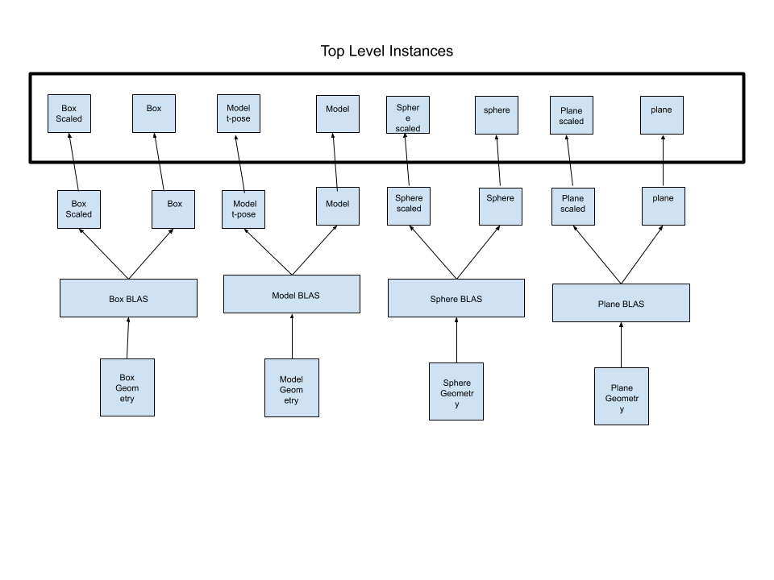

**University of Pennsylvania, CIS 565: GPU Programming and Architecture,
Project 5 - DirectX Procedural Raytracing**

* Eric Micallef
  * https://www.linkedin.com/in/eric-micallef-99291714b/
  
* Tested on: Windows 10, i5, Nvidia GTX1660 (Personal)

### Conceptual Questions

* 1 Ray tracing begins by firing off rays from the camera's perspective, with 1 ray corresponding to 1 pixel. Say the viewport is (1280 by 720), how would you convert these pixel locations into rays, with each ray being defined by an Origin and a Direction, such that Ray = Origin + t * Direction? Consult this intro to camera transformations and this explanation of world-to-screen/screen-to-world space article to formulate an answer in your own words. *

at a high level the rays live in pixel space where as the camera and objects in the scene are in world space. pixel space is 2d where as scene and world space are 3d. to convert from scene to world we can create a matrix and inverse matrix to convert from each domain respectively.

Pscreen = Pworld * MatrixInverse
Pworld = Pscreen * Matrix

The harder part is converting from 2d to 3d. To do this we need to do map our pixel in a range from 0 --> 1

we can do this by the following equations.
PnormX = (( Px + width/2) / width)
PnormY = (( Py + height/2) / height)

we then neec to invert our y as we want to point down instead of up:

PnormY = -PnormY

Following this we can now convert to screen space 

PrasterX = PnormX * width
PrasterY = PnormY * height

When converting we must also remeber to divide by our perspective. So in our 4x4 matrice at some point we must divide by W.

like so.

InverseProjectionMatrix * (x,y,z,w) = (x',y',z',w') / w = (x'/w , y'/w, z'/w, w'w/) 

I will then implement these equatiosn and likely it will not work.

2 Each procedural geometry can be defined using 3 things: the Axis-Aligned Bounding Box (AABB) (e.g. bottom left corner at (-1,-1,-1) and top right corner at (1,1,1)) that surrounds it, the Type (e.g. Sphere) of the procedural geometry contained within the AABB, and an Equation describing the procedural geometry (e.g. Sphere: (x - center)^2 = r^2). Using these 3 constructs, conceptually explain how one could go about rendering the procedural geometry. To be specific, consider how to proceed when a ray enters the AABB of the procedural geometry.

When a ray enters our AABB we want to check if it has actually hit the object in the AABB. if it has not we can register it as a miss but, if it has hit then we need to render. We can then render based on our intersection shader of our object. if it is reflective we can spawn a new ray, else we head to light. 

3 Draw a diagram of the DXR Top-Level/Bottom-Level Acceleration Structures of the following scene. Refer to section 2.6 below for an explanation of DXR Acceleration Structures. We require that you limit your answer to 1 TLAS. You may use multiple BLASes, but you must define the Geometry contained within each BLAS.

