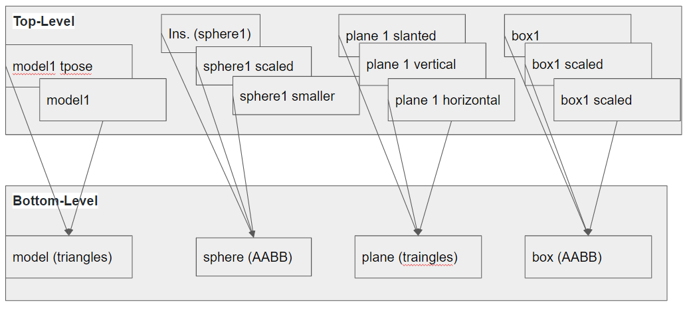
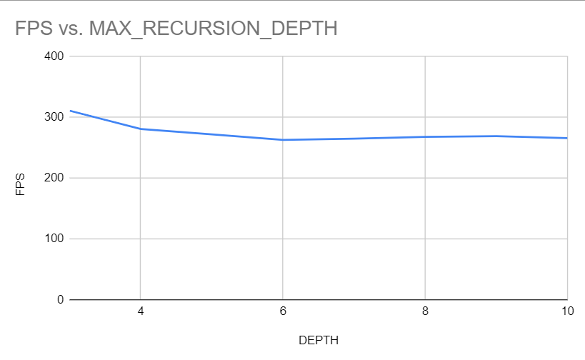

**University of Pennsylvania, CIS 565: GPU Programming and Architecture,
Project 5 - DirectX Procedural Raytracing**

* Gangzheng Tong
  * www.gtong.me
* Tested on: Windows 10, i7-8750H @ 2.20GHz 16GB, RTX 2070 8GB (personal laptop)

### Overview

This project implements a raytracing based scene renderer and demonstrates the usage of DirectX 12 Raytracing API. It utilizes the built-in acceleration structure, analytic and procedural geometry construction and shadow ray testing.

### Contents

- Ray Tracing Concept
- Acceleration Structure
- Output
- Performance Analysis
- Bloopers

### Ray Tracing Concept

Unlike path tracer, ray tracing based renderer simples the the rendering and calculation significantly by only keeping a few rays for each pixel and shading point rather than spawning multiply rays based on BSDF. In this project, we only consider:

- **Primary ray**: the ray shot from camera to each pixel. We need to apply the project_to_world transformation in order to bring the ray to the world coordinate, for further intersection testing with the scene.

- **Shadow ray**:  from the closest_hit point, spawn a shadow ray to the light source to find out if this point is in shadow. It's still cheap for scenes with only a few light sources.

- **Reflected ray**: calculating the reflected ray based on the incident ray direction and normal of hit point. Perform another trace like the primary ray but with the depth incremented.

  

### Acceleration Structure

##### Diagram of DXR Top-Level/Bottom-Level Acceleration Structures

### Output

- Static light and static camera, 4 metaballs and 3 spheres 

- Animating light source

- Animating camera

### Performance Analysis

- With the max recursion depth increased from 3 to 10, initially there is a drop in the FPS from 3 to 5, but it quickly stables at around 280 FPS. 
- It makes sense since the scene doesn't have too many reflected materials and most of rays terminated after 5 bounces.

### Bloopers

When I used **pow(x, 5)** to calculate **x *  x *  x *  x *  x**

### References

- https://github.com/Microsoft/DirectX-Graphics-Samples
- https://docs.microsoft.com/en-us/windows/win32/direct3d12/directx-12-programming-guide