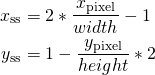
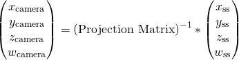
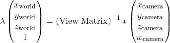

**University of Pennsylvania, CIS 565: GPU Programming and Architecture,
Project 5 - DirectX Procedural Raytracing**

* Author : Kushagra
  * [LinkedIn](https://www.linkedin.com/in/kushagragoel/)
* Tested on : Windows 10, i7-9750H CPU @ 2.60GHz 16GB, GTX 1650 4GB (Personal Computer)

____________________________________________________________________________________

## Conceptual Questions
This part is due Sunday, October 19th.

Answer these conceptual questions. They may help you gain a solid understanding of Raytracing and DXR. Include your answers in your README, then make a GitHub pull request highlighting your answers:

##### 1. Ray tracing begins by firing off rays from the camera's perspective, with 1 ray corresponding to 1 pixel. Say the viewport is (1280 by 720), **how would you convert these pixel locations into rays**, with each ray being defined by an `Origin` and a `Direction`, such that `Ray = Origin + t * Direction`? Consult this [intro](https://www.scratchapixel.com/lessons/3d-basic-rendering/computing-pixel-coordinates-of-3d-point/mathematics-computing-2d-coordinates-of-3d-points) to camera transformations and this [explanation](http://webglfactory.blogspot.com/2011/05/how-to-convert-world-to-screen.html) of world-to-screen/screen-to-world space article to formulate an answer in your own words.

*  We start by assuming pixel locations are given relative to top left corner of the image plane with coordinate essentially representing the number of pixels.  
We begin finding the Image Plane coordinates by finding the screen space coordinate of the center of the pixel (the 0.5) dividing it by the screen dimensions and then subtracting 1. Note we mirror the y axis as the axes point towards the opposite directions in the pixel and screen space. 
  
Then we set the z coordinate to zero and add a 4th coordinate (w) as one to proceed to reverse the projective transform as  
  
And then finally undoing the view transform and then dividing the by the 4th coordinate we get the world coordinates. 
  
`Origin` is the `world coordinates of the camera` and the `Direction` is the `world coordinates of the pixel - world coordinates of the camera`.  

##### 2. Each procedural geometry can be defined using 3 things: the `Axis-Aligned Bounding Box` (AABB) (e.g. bottom left corner at (-1,-1,-1) and top right corner at (1,1,1)) that surrounds it, the `Type` (e.g. Sphere) of the procedural geometry contained within the AABB, and an `Equation` describing the procedural geometry (e.g. Sphere: `(x - center)^2 = r^2`). **Using these 3 constructs, conceptually explain how one could go about rendering the procedural geometry**. To be specific, consider how to proceed when a ray enters the AABB of the procedural geometry.  

*  AABBs are the boxes which enclose the procedural geometry and to determine whether the ray enters the AABB at all or not. Once we are certain that the ray enters the AABB of the procedural geometry, then we can look up the type of the geometry in the AABB and then use the corresponding equation to find if the ray intersects the surface of the geometry. Once we know that there is an intersection, then we can use the appropriate shader with the point of intersection and the normal to find the color of the ray. For finding whether a ray intersects a geometry or not, we can either use some condition (like the distance criterion for spheres) or ray marching or sample different points and see if 2 of them are on different side of a surface.

##### 3. **Draw a diagram of the DXR Top-Level/Bottom-Level Acceleration Structures** of the following scene. Refer to section 2.6 below for an explanation of DXR Acceleration Structures. We require that you limit your answer to 1 TLAS. You may use multiple BLASes, but you must define the Geometry contained within each BLAS.  

  

 *  
