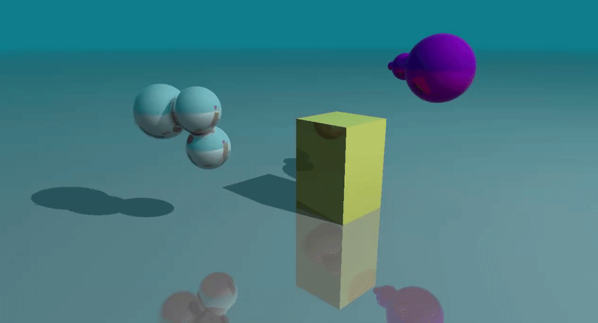
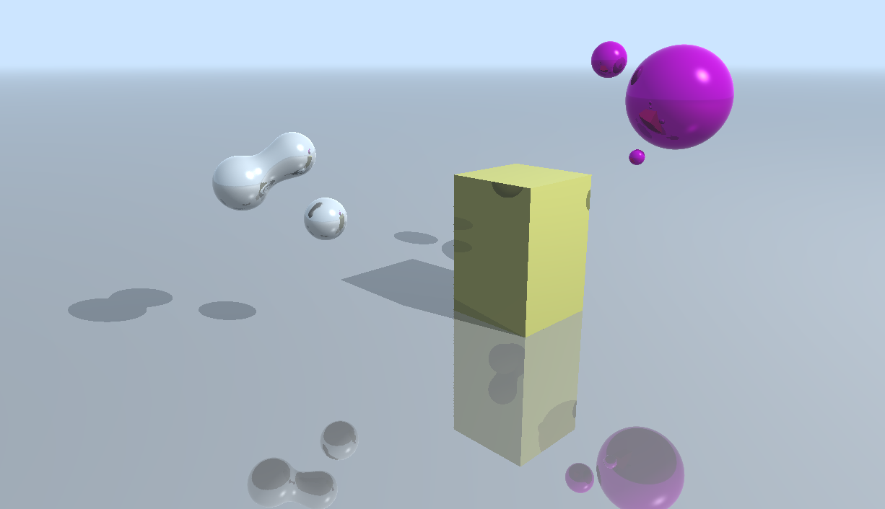
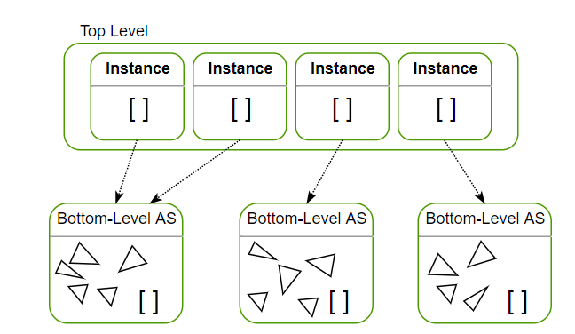
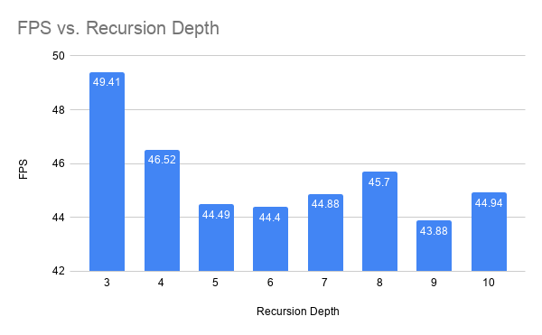
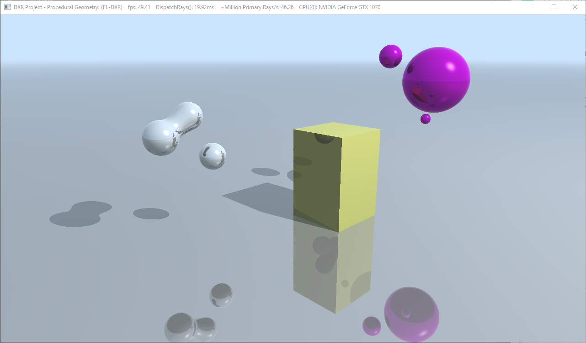
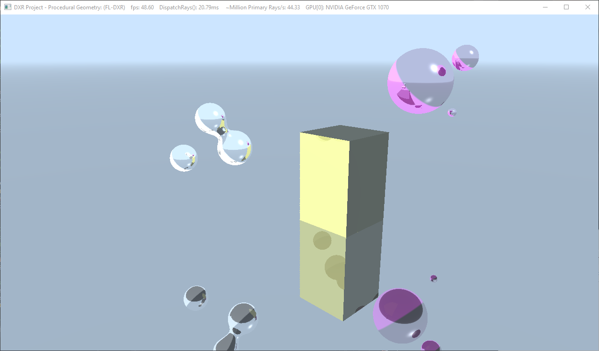
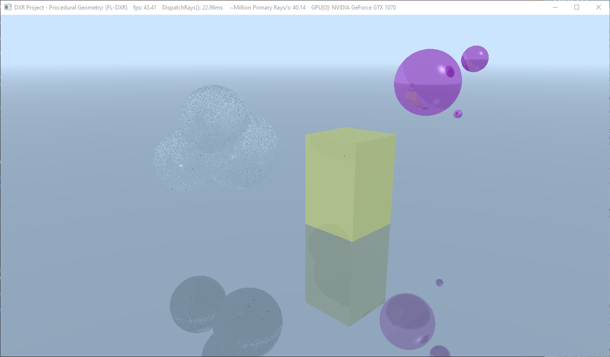

# DirectX Procedural Raytracing

**University of Pennsylvania, CIS 565: GPU Programming and Architecture,
Project 5 - DirectX Procedural Raytracing**

* Klayton Wittler
    * [LinkedIn](https://www.linkedin.com/in/klayton-wittler/)
* Tested on: Windows 10 Pro, i7-7700K @ 4.20GHz 16.0GB, GTX 1070 8.192GB (my PC)

## Sections

* [Introduction](#introduction)
* [Performance Analaysis](#performance-analysis)
* [Bloopers](#bloopers)

*Note: Banded artifacts are a result of the recording not the rendering process.*

# Introduction

This project implents real time ray tracing with the DXR API.

Ray tracing works by shooting rays at each pixel from the camera into the scene. On collision, the recursion depth is incremented and the rays go towards the light to color the object. If the ray hits another object, it is marked as a shadow ray. If a ray collides with any reflecting material it sends off another ray but also changes the original ray according to Snell's Law as long as the recursion depth as not been reached.

Below is the graphical representation of this pipeline.

In order to speed up intersection tests, and acceleration structure is used to define rules for the ray in traversing geometry. 

Each instance in the top level is a realization of a particular geometry in the bottom level. The geometry in the bottom level contains simple equations for intersection tests based on the particular geometry. The top level instance can be translated, scaled, and rotated to created various objects around the scene that appear different. However, if a ray enters the AABB the ray is transformed into the original bottom level structure and then can perform a simple intersection test according to the geomtrical equation.

# Performance Analaysis

Below the impact of increasing the recursion depth of ray bounces on frame rate can be seen. The higher the frame rate the better and it can be seen that 3 is the optimal depth in terms of frame rate. The depth cannot be lower than 3 in order to capture reflectance and shadow rays.

In the sample images below, it can also be seen that the additional depth increases the sharpness of the image marginally but not enough to justify the frame rate drop.

Recursion Depth | Image
:-------------------------:|:-------------------------:
3 |
7 | 
9 | 

# Bloopers

Incident Light Ray | Metaball Potentials
:-------------------------:|:-------------------------:
| 

* Incident Light Ray: reversed the direction of the light rays in the Phong and Fresnel lighting equations.
* Metaball Potentials: incorrectly accounted for the ratio into the metaball in calculating the potential
