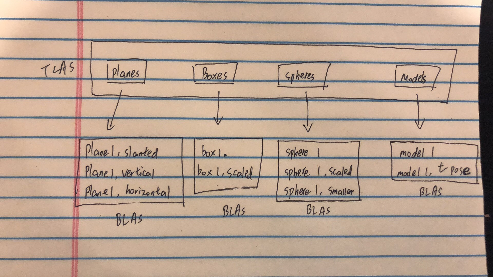
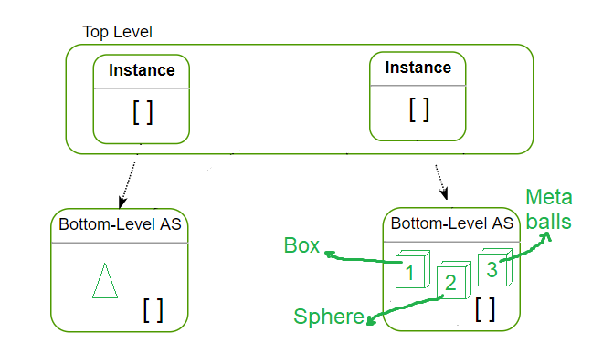

# Project 5 - DirectX Procedural Raytracing
================

**University of Pennsylvania, CIS 565: GPU Programming and Architecture, Project 5**

* Weiqi Chen
  * [LinkedIn](https://www.linkedin.com/in/weiqi-ricky-chen-2b04b2ab/)
* Tested on: Windows 10, i7-8750H @ 2.20GHz 2.21GHz, 16GB, GTX 1050 2GB

## Conceptual Questions

1. In order to get the ray origin and direction for a pixel, we need to do the reverse of rasterization and transform a pixel's coordinate into the world space. Given a viewport of 1280 x 720 and a pixel coordinate (x, y) in the range of [0, 1279/719], We need to do the following steps:

* Convert the point to Normalized Device Coordinate space. x = x / Pixel Width and y = -y / Pixel Height + 1
* Convert the point in NDC space to screen space. x = x * width - width / 2 and y = y * height - height / 2.
* Set the z coordinate to be -1 for each pixel and convert the pixel coordinate and camera position with the inverse of the view projection matrix to get world space coordinates.
* The origin of each pixel will be the world space camera position and its direction `dir` will be (world space pixel coordinate - world space camera position)

2. When a ray enters the AABB of the procedural geometry, we need to find out if the ray intersects with the geometry or not based on the Type of the geometry. This can be done using analytical solutions to for example ray-cube intersection or raymarching. If the ray hits the geometry, the intersection point and the surface normal will be used for rendering and the ray will be colored. The ray will then try to go to the light source directly. If it fails, then the ray will be shadowed since it is blocked by some other geometry.

3. 

## Project Summary
In this project, the goal is to use the newly released DirectX Raytracing API to ray trace procedural geometries. It consists of the CPU side of the code for setting up the rendering pipeline and the GPU side of code for the actual rendering pipeline execution.

`DirectX` is a graphics API developed by Microsoft. `DirectX Raytracing (DXR)` is an API extension that supports GPU raytracing capabilities (mostly NVIDIA high end GPUs).

## Raytracing
Ray tracing is a rendering technique for generating an image by tracing the path of light as pixels in an image plane and simulating the effects of its encounters with virtual objects. It is similar to path tracing except that it is deterministic and we only do a single pass over the entire scene.

In this project, we use a minimum depth of 3 to allow tracing the following:
1. a radiance ray generated from camera
2. a shadow ray in case the ray hits a geometry on its way to the light source
3. a reflection ray in case the material is reflective.

The lifecycle of a ray can be described as:
1. Generate a ray and check if it hits anything.
2. If it hits something, try to color it:

  a. Coloring a ray means tracing the ray toward the light source.

  b. If the ray hits something on its way to light source, then the region is shadowed; else the ray is colored.

3. If the ray hits a reflective material at any time, trace the reflected ray with the same process.

The diagram below shows the process of raytracing.

## DXR Execution Pipeline
The diagram below shows the DXR execution pipeline.

It is worth mentioning that the entire raytracing pipeline and data must be ready for the GPU before any raytracing happens.

DXR On the CPU side:

First we need to populate structs with the scene data containing a camera, lights and transform for objects to render to the GPU. This data is then allocated and uploaded to the GPU. We also need  to initialize root signatures as descriptors of some type of resource to programmatically read/write to various data from GPU. Next we will build hitgroup subobjects including  a `Closest Hit Shader`, at least one `Intersection Shader`, and an optional `Any Hit Shader` for transparency testing. The hitgroup is located on the right side of the diagram above. Geometry data will be allocated and uploaded as triangles (vertices and indices) and procedural geometry data (axis-aligned bounding box) to GPU. To boost performance, the entire scene is divided into `Top Level Acceleration Structure` and several instances of `Bottom Level Acceleration Structure`.

To allow GPU shaders work depending on the type of ray and the type of geometry the ray hits, `Shader Table` is needed. Finally, we will execute the command list and call Dispatchrays().

DXR On the GPU side:
We will implement the actual ray generation here and trace the radiance and shadow rays.
We also need to implement `Miss Shader` and `Intersection Shader` for the two types of rays. Specifically, we will create custom intersection shader for multiple spheres and metaballs. Phong lighting model and Schlick's approximation are both implemented here. A `Closest Hit Shader` for triangles that can slightly blur faraway triangle and one for procudural geometry are built.

## Performance analysis
The bar plot below shows the effect of ray depth on FPS. As the ray depth increases, the performance also decreases a little bit.

## Raytracing Results

* C - enable/disable camera animation.
* G - enable/disable geometry animation.
* L - enable/disable light animation.

| C on | G on | L on | All on |
| -- | -- | -- | -- |
|  |  |  |  |
