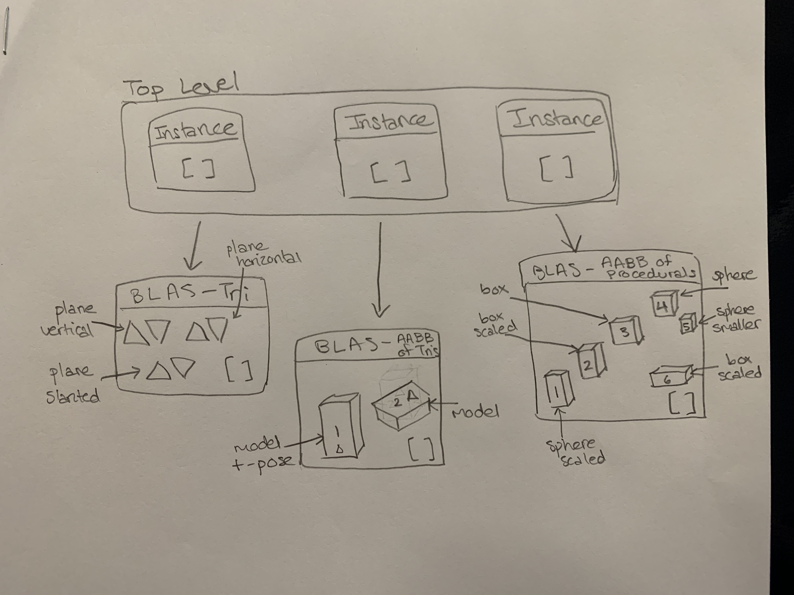

**University of Pennsylvania, CIS 565: GPU Programming and Architecture,
Project 5 - DirectX Procedural Raytracing**

* Tabatha Hickman
  * LinkedIn: https://www.linkedin.com/in/tabatha-hickman-335987140/
* Tested on: Windows 10 Pro, i7-5600U CPU @ 2.60GHz 16GB, GeForce 840M (personal computer)

### Conceptual Questions

1. Ray tracing begins by firing off rays from the camera's perspective, with 1 ray corresponding to 1 pixel. Say the viewport is (1280 by 720), **how would you convert these pixel locations into rays**, with each ray being defined by an `Origin` and a `Direction`, such that `Ray = Origin + t * Direction`?

The origin of the ray is always the camera's position in world space because the rays are shot from the camera toward the scene. To calculate direction, first you find the pixel's location in screen space using the camera's resolution. Then you transform this point into world space by multiplying it by the homogeneous coordinate, then by the inverse projection matrix, and finally by the view matrix. Now that this point is in world space, we can get the vector between it and the origin and normalize this for the ray direction. The t in the equation is computed when intersections with objects in the scene are calculated. The minimum positive t value of those intersections gives us the location of the intersection between the ray and the geometry which will appear in the render.

2. Each procedural geometry can be defined using 3 things: the `Axis-Aligned Bounding Box` (AABB) (e.g. bottom left corner at (-1,-1,-1) and top right corner at (1,1,1)) that surrounds it, the `Type` (e.g. Sphere) of the procedural geometry contained within the AABB, and an `Equation` describing the procedural geometry (e.g. Sphere: `(x - center)^2 = r^2`). **Using these 3 constructs, conceptually explain how one could go about rendering the procedural geometry**. To be specific, consider how to proceed when a ray enters the AABB of the procedural geometry.

A technique called sphere marching can be used for this. Given a ray that we are casting into the scene and an initial intersection which could be the ray origin or in this case the intersection with the AABB, we can find the distance to the procedural shape from the intersection using it's Equation. If we simplify the Equation such that one side of the equation is zero, then the other side is the distance calculation with x being the point on our ray we are currently checking. Once the distance is calculated, we check if it is less than some epsilon value that represents the precision we want for the intersection. If it is less than this value, the position on the ray we have right now is the intersection point with the procedural geometry. If not, then we calculate a new test position by adding the distance we calculated to the t value of the point we just checked (t = 0 at ray origin). Then the new position to check distance next is ray direction * t + ray origin. We continue this process until we discover an intersection point or the distance calculated becomes too large (which would mean the ray missed the geometry).

3. **Draw a diagram of the DXR Top-Level/Bottom-Level Acceleration Structures** of the following scene. Refer to section 2.6 below for an explanation of DXR Acceleration Structures. We require that you limit your answer to 1 TLAS. You may use multiple BLASes, but you must define the Geometry contained within each BLAS.

