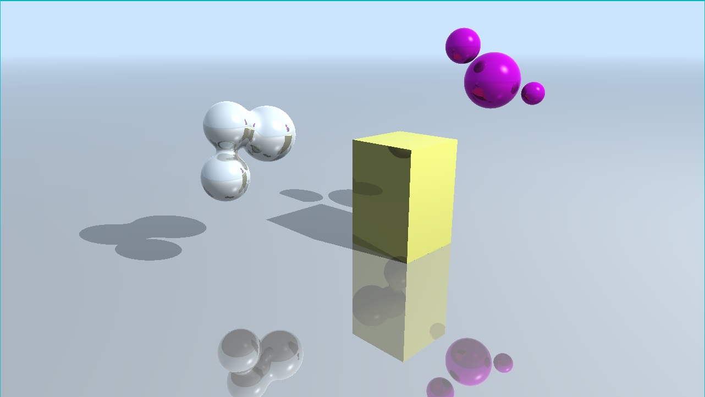
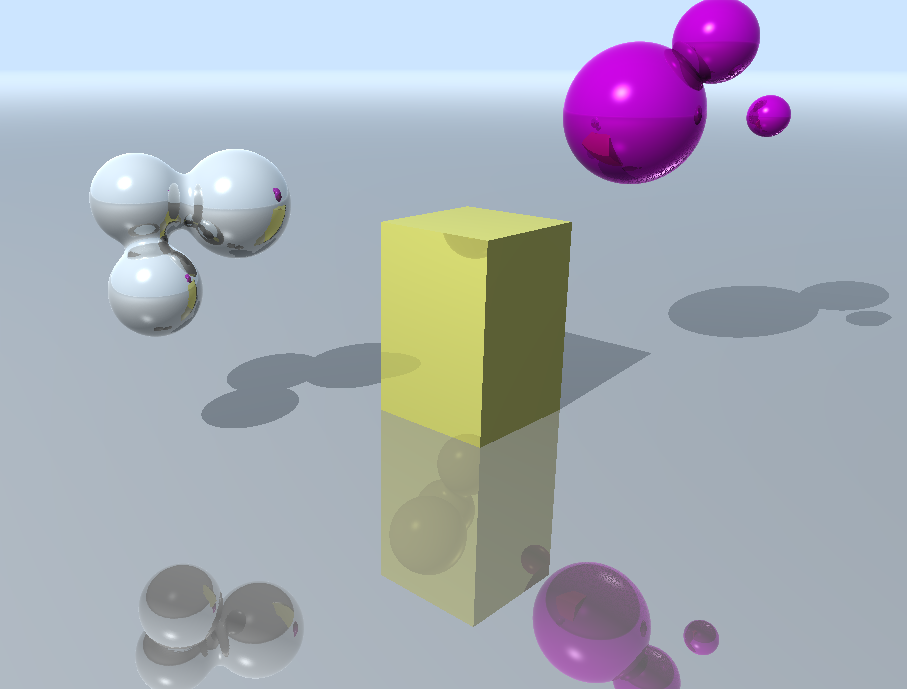
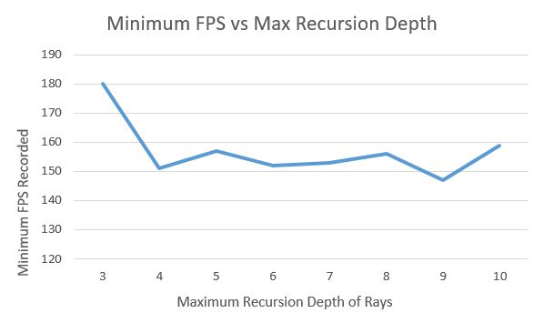

**University of Pennsylvania, CIS 565: GPU Programming and Architecture,
Project 5 - DirectX Procedural Raytracing**

* Tabatha Hickman
  * LinkedIn: https://www.linkedin.com/in/tabatha-hickman-335987140/
* Tested on: SIGLAB computer

## DirectX Procedural Raytracing

This project utilizes Microsoft's DirectX to perform raytracing of both triangle meshes and procedural geometries on the GPU. 

Raytracing involves shooting rays from the camera to each pixel on the screen, then deterministically calculating intersections, reflections, and shadows. Each ray is traced through the scene only once, and terminates either if it misses all geometry or if we have reached a defined maximum recursion depth. The rays generated from the camera are called radiance rays and the rays shot from each intersection to the light source in order to determine coloring are called shadow rays. 

In order to have all this computation occur on the GPU, we need to set up several things on the CPU side. 

To send data from the CPU to the GPU, we allocate and upload buffers. For all the scene information (camera, lights, material colors, and transforms), we put this all in one struct and use a Constant Buffer, a DXR GpuUploadBuffer that holds only one struct, to upload it. The only other information we need to send to the GPU are the transformations from local geometry space to BLAS space and vice versa (information on BLASes to come). For this we use a StructuredBuffer, which can hold multiple structs, so we can send transformations for each of the instances of geometry.

We also want to set up global and local parameters in the GPU shaders, which are called root signatures. This is accomplished by creating either constant values or resources on the CPU and creating descriptors to those resources. The descriptors can be of type UniformAccessView, ConstantBufferView, or ShaderResourceView. Each descriptor type has its own shader registry and we set up the descriptors so that each parameter has its own shader registered counting up from 0 for the type of descriptor it is. In other words we can have a UAV descriptor at register 0 and a SRV descriptor at register 0 because they are in different registrys as different types, but if we add another SRV descriptor, it goes in register 1.  

Now for the raytracing specifics. Each object needs a hitgroup to define how intersections, reflection, and shadows will be calculated for it. The hitgroup includes a closest hit shader, used for radiance rays, at least one intersection shader, and an optional any hit shader. We import shaders (by filename) for some set of these types for each combination of geometry and ray type. We also connect any relevant local root signatures to these shaders. Then, we create a shader table, one for each type of shader (raygen, miss, or hitgroup). These basically organize all the shaders into a sort of buffer so that we know which shaders are needed for each ray type and primitive type.

We also need to know some information about the geometry, procedural or not. For the triangle-based meshes, we need index and vertex buffers, and for the procedural geometries, we need to define their bounding boxes in the x, y, and z planes. (These buffers should already have corresponding root signatures declared for them.)

To optimize the raytracing, we can use an acceleration structure. DXR has a built in acceleration structure that involves top-level structures (TLAS) which hold instances of bottom-level structures (BLAS) which hold descriptors of geometry. We just need to create, set up, and pass geometry to these structures, and DXR will do the rest. For this project, our scene has a triangle mesh plane and three procedural geometries. Therefore, we define one TLAS with two instances of BLASes, one that holds triangles, and the other that holds AABBs, or bounding boxes with data about procedural geometry. All of these instances and descriptors can be created by making DXR defined structs and filling in their parameters. 

All of these tasks are performed by sending them as computations to a command list, which executes and calls DispatchRays to begin the actual raytracing.

Now for the GPU side, where we define kernels for tracing rays, computing intersections, and coloring surfaces.

We need to write a kernel which generates rays from the camera (the ray origin is its world space position) to each pixel in the screen. Using the id of any given ray, we get its location in pixel space using the dimensions of the screen. Then, we convert that into NDC space and then into world space so that we can get the direction of the ray. We also utilize the DXR function TraceRay() to call one of our intersection shaders based on what type of ray (radiance or shadow) we encounter. We must implement shaders to determine what happens to the ray based on what we hit. For example, a miss shader simply colors the pixel with the background color. Intersection shaders find all intersections of the ray with all geometry in the scene. Closest hit shaders concern themselves only with the intersection closest to the camera (with the minimum t value) and will shoot shadow rays and reflected rays. 

One of the more fun parts of this project was writing a function for intersection with metaballs (which would be used in intersection shaders). Given a set of balls, each of which having a center and a radius, we find all the intersection points of a given ray with these spheres and determine which one is the first (the entrance point, or minimum t value) and which one is the last (the exit point, or maximum t value). Then we divide the distance between these two points into incremental steps, and go through these steps one by one. At each point, we calculate a potential which is based on the point's distance from the center of any sphere. If the potential is greater than a threshhold we stop and use this as the intersection point, otherwise we go to the next step along the ray and try again. We also animated the metaballs in a cyclic pattern (using a simple sine function) so that we could see their unique deformations at work. 

To color our surfaces, we used a combination of diffuse and specular surface shading. Reflected colors were determined by summing ambient, diffuse (Lambertian), and specular (Phong) components. Then, using Schlick's approximation for Fresnel reflection, we determine a good ratio of the reflected color and the diffuse color and use this weighted combination as the surface color. Finally, we achieve a slight distance falloff toward the background by interpolating between the background color and the computed color.

## Performance Testing

Below is a chart of the minimum recorded FPS while running the raytracer vs the maximum recursion depth allowed. I'd like to note that the FPS followed a similar behavior over time (with all of camera, geometry, and lights being animated) for all of the tested recursion depths, starting at its minimum, increasing to 200-250 FPS, then decreasing back to about 30 FPS more than its minimum. As you can see, a recursion depth of 3 is significantly faster than depths of 4-10, but of the results from 4-10 there isn't much of a trend. One would expect to see some sort of steady decrease in FPS as recursion depth increases because more calculations must be done for each bounce, but I suspect that because there is so little geometry in the scene, most of the rays terminate due to misses after 2-3 bounces, so we don't see very much of a change.

