**University of Pennsylvania, CIS 565: GPU Programming and Architecture,
Project 5 - DirectX Procedural Raytracing**

* Grace Gilbert
  * https://www.linkedin.com/in/grace-gilbert-2493a0156, http://gracelgilbert.com
* Tested on: Windows 10, i9-9900K @ 3.60GHz 64GB, GeForce RTX 2080 40860MB


<p align="center">
  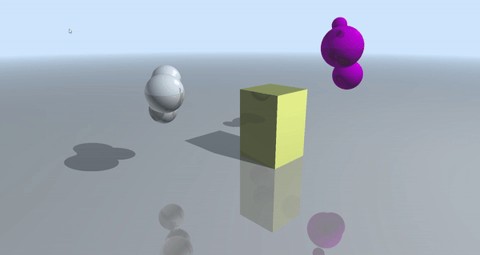
</p>

# Overview
In this project, I made a real-time raytracer using a DirectX Raytracing rendering pipeline.  The raytracer can render triangulated mesh objects, used for the ground plane, analytic procedural geoemtries, including spheres and boxes, and volumetric procedural geometry, metaballs.  These objects are rendered shaded with Phong reflection combined with Schlick's approximation of fresnel reflection. 

# Resources
- DirectX documentation: https://microsoft.github.io/DirectX-Specs/d3d/Raytracing.html
- Phong reflection model: https://en.wikipedia.org/wiki/Phong_reflection_model
- Schlick's approximation: https://en.wikipedia.org/wiki/Schlick%27s_approximation

# Implementation
## CPU Setup
In order to perform DirectX raytracing on the GPU, we must first send all of the necessary data to the GPU.  This data is prepared and sent from the CPU.
### Passing Data
To pass data to the GPU, we have to populate buffers with the data to be passed, and then map the data to a region in memory that the GPU can read.  This is accomplished with the GpuUploadBuffer struct.  There are two types of buffers, a constant buffer and a structured buffer.  

A constant buffer is a buffer that can hold a single struct.  We use constant buffers to store the scene data, which includes the lights, camera projections, and elapsed time. We also store material data for the proceudral geometry as well as other meta data in constant buffers.

A structured buffer can hold multiple structs, behaving like an array of constant buffers.  We use structured buffers to store transforms for procedural geometry, triangle position data.  

Once we have the buffers set up, we need to tell the GPU how to access and read the data we passed. We use root signatures to do this. Root signatures can be global, accessed by any defined GPU function, or local, only accessible in some shaders. Root signatures act as a descriptor of a type of resource.  We use three different types of descriptors: ConstantBufferView, ShaderResourceView, and UniformAccessView.  We can tell the GPU where to store the root signature, and then can provide information about the data it represents and how to read it. 

We now have the data passed to a place accessible by the GPU, and a description for how that data should be read on the GPU.  Later in the pipeline, when we finally dispatch the raytracing call, we establish a link between this data and the instructions for how to read the data, completing the data transfer process.

### Geometry
An important part of raytracing is setting up the geometry that will be displayed on screen.  The first part of setting up the geometry is to set up the hit groups. A hit group specifies the closest hit shader, any hit shader (which we do not use), and the intersection shader (required for all geometry except triangles).  Depending on the type of geometry, we want to apply differnet shaders.  For example, the closest hit shader of a triangle geometry differs from that of a procedural geometry, so we want to specify this to ensure that the GPU uses the right hit groups for each geometry.

We also need to pass in the geometry position and transformation data so the GPU knows where to draw the geometry.  For triangles, this is the vertex positions and the indices that represent the triangles.  For procedural geometry, we must pass in the type of procedural geometry and the axis aligned bounding box (AABB), as well as the transformation of the geometry to its position in the scene. There are two types of procedual geoemtry, volumetric and analytic, and this will change how intersections with the geometry are calcualted.   

The final step in passing the geometry data to the GPU is organizing it in acceleration structures. The raytracing process is expensive, so organizing the geometry into acceleration structures can speed up performance. DXR has built in acceleration structure generation, we just need to pass in the data in the correct way. The acceleration structure consists of Top Level Acceleration Structures (TLAS), and Bottom Level Acceleration Structures (BLAS). The BLAS holds geometry data, and the TLAS holds instances of a BLAS. For example, a BLAS can hold data that represent a sphere, and a TLAS can have multiple instances of that BLAS, each with different transformations, materials, and other properties describing that sphere. 

In our project, we have two BLAS's. One BLAS contains triangle data, and the other holds all of the procedural data, meaning the sphere, box, and metaball data. We then have one TLAS that contains one instance of a triangle BLAS and one instance of the procedural BLAS.

### Dispatch
Once we have all of the data set up and passed to the GPU, which now knows how to read in that data, we can finally dispatch our rays to begin the raytracing process. This is where we bind our buffers to the root signatures we created, connecting the data we passed to the instructions we gave to read that data. After all the linking is set, we can call DispatchRays, which dispatches one thread per pixel, where each thread performs the calculations of one ray.

## GPU Raytracing
### Ray Generation
Essential in raytracing is actually casting the rays into the scene.  To do this, we need to get a ray origin and direction for every pixel. Because we are casting rays from our camera eye, the ray origin will always be the position of the camera. To get the ray direction, we first must find the position of each pixel in world space. To do this, we convert the pixels from screen space to NDC space, and then project them to world space using the camera's projection matrix. Once we have this world space position of the pixel, we can get the direction from the camera's eye to the pixel, and that is our ray direction. There are two types of rays in our scene, radiance rays and shadow rays.

#### Radiance Rays
Radiance rays are rays that are traced until they hit the nearest object. Upon hitting that object, they're job is to determine the color that reaches the orign of the ray, which will ultimately be the color that reaches the camera lens and is displayed on screen. If the object is reflective, we cast another radiance ray to get the color of the reflection. We do this iteratively, capping the number of ray iterations to 3 to avoid infinite loops. If a ray misses all geometry in the scene, it returns the background color. 

#### Shadow Rays
In addition to casting reflection rays, we also cast shadow feeler rays each time we intersect an object. Shadow rays are rays cast directly towards the light source to determine if the intersection point is occluded and in shadow. These rays do not return a color or intersection information, rather just a boolean of whether the ray reached light or hit an object on the way. If the ray is in shadow, meaning it hits and object before reaching light, we darken the color value of the intersection.

### Geometry
For all geometry, we essentially perform the same closest hit shader. This means that when we hit a piece of geometry, we trace a shadow ray to see if it is in shadow. We also trace a reflection ray using Snell's law to get the reflected color, and Schlick's approximation for Fresnel reflection. The shape of the geometry is determined by the intersection function

#### Triangles
Triangle intersection is built into DXR, so we do not need to implement a triangle intersection shader of our own.

#### Box
Box intersection is essentially just intersecting with the AABB, as the AABB is already the shape of the box we want to render. The normal of the intersection point is determined by which face of the box was hit. 

#### Sphere
Sphere intersection is done by setting the ray equation equal to the equation for a sphere to determine which position along the ray is also a position on the sphere. This results in solving a quadratic equation. If there are two solutions, meaning the ray hits the sphere entering and leaving, we use the smaller one as the minimum hit position. To calculate the normal at this intersection, we take the normalized direction from the center to the hit position.

#### Metaballs
For metaballs intersection, we use raymarching. We first start by intersecting the metaball sphere os influence as if they were regular spheres. This gives us minimum and maximum bounds for where our intersection might occur. We then start at the minimum possible intersections and take incremental steps until we have hit the metaball surface. To check if we've hit the surface, we calculate the accumulated potential of the metaballs at that point, which is the sum of the potential for each individual metaball.

The potential calculation for the metaballs is a quintic expression that depends on the distance of the position to the center of the metaball in relation to the radius of influence. If the position is outside the sphere of influence, the potential is 0, and if it directly at the center of the metaball, the potential is 1. Otherwise, the potential is calculated as follows:

```
distance = distance(currentPosition, metaballCenter)
x = (radius - distance) / radius
potential = 6x^5 - 15x^4 + 10x^3
```
If the sum of the potentials of all the metaballs exceeds a certain threshold, then we consider that an intersection. To calculate the normal at that intersection, we use a gradient of the potential. 

0.05 Threshold           |  0.5 Threshold               | 0.8 Threshold
:-------------------------:|:-------------------------:|:-------------------------:
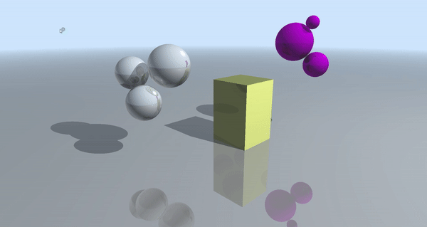| 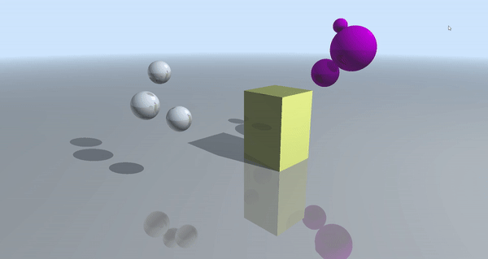 |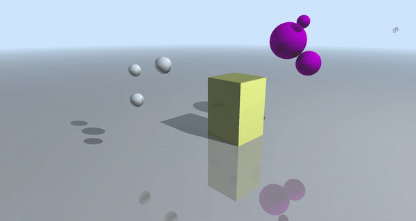


### Shading
Shading is calculated in the closest hit shader. When we hit an object, we want to determine the color at that point on the object. The first step is finding the reflected color and determining if the point is in shadow. Next we apply Phong lighting and Fresnel reflection. The color found in Phon lighting gets added to the reflected color.

#### Phong Lighting
Phong lighting is a way to get specular highlights on materials in the direction of the light source.  First there is some ambient color to prevent areas of complete darkness. Next we calculate the diffuse coefficient, which applies lambertian shading. This makes it so that surfaces that face the light head on are brighter, and surfaces that face the light as a grazing angle do not get as much light. 

Finally we get the specular coefficient. To do this, we get the reflected ray direction using the built in reflect function, reflecting the incident light ray about the normal of the intersection.  The coefficient can then be calculated as follows:
```
SpecularCoefficient = dot(reflectedRay, -incidentLightRay) ^ specularPower
```
The final color returned is as follows:
```
outputColor = ambientColor + albedo * (diffuseCoef + specularCoef)
```
The specular power affects how bright and pronounced the specular highlights are.

Specular Power 1           |  Specular Power 50               | Specular Power 500
:-------------------------:|:-------------------------:|:-------------------------:
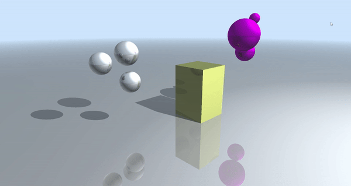| 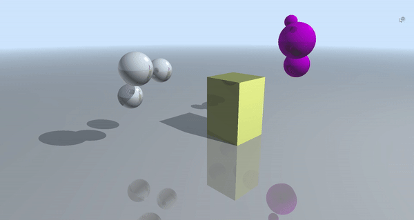 |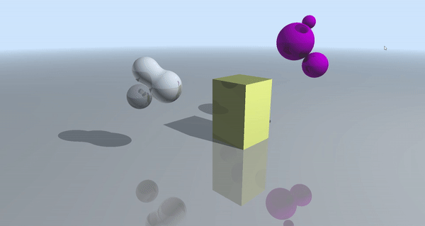
#### Fresnel Reflections with Schlick's Approximation
Fresnel reflection scales the reflection based on the incident angle of the incoming ray and the indices of refraction of the materials. The scale value we apply to the reflected color is calculated as follows:

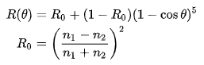

In the above equation, n1 and n2 are the indices of refraction, and cos(theta) is the dot product of the normal and the incident angle.

The indices of refraction influence how reflective the surface appears.

IOR 1: 3.5, IOR 2: 0.05    |  IOR 1: 1.5, IOR 2: 0.2   | IOR 1: 1.5, IOR 2: 1.0
:-------------------------:|:-------------------------:|:-------------------------:
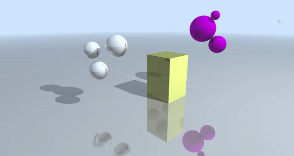|  |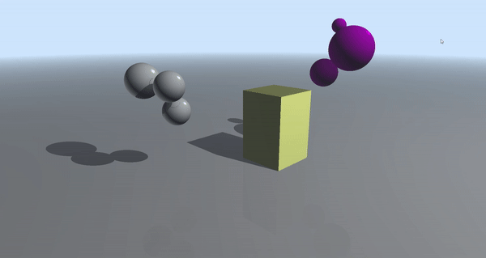

### Distance Falloff
To provide a smooth transition between the scene and the background, I apply a distance falloff. To do this, when setting the color at an intersection in the closest hit shader, I linearly interpolate between the actual color and the background color. The interpolation value depends on the t value of the intersection, meaning the depth from the camera. When the intersection is farther from camera, the background color has a stronger influence, causing a smooth transition from the scene to the background. This transition can be sharpened or smoothed out by manipulating scaling the depth value. 

Smooth Falloff    |  Medium Falloff   | Sharp Falloff
:-------------------------:|:-------------------------:|:-------------------------:
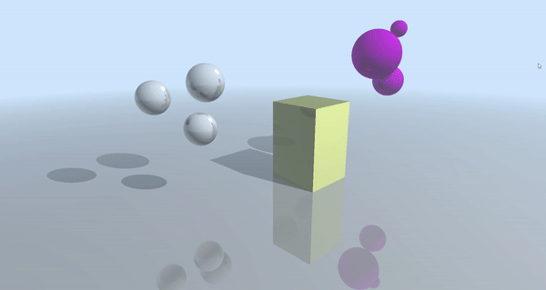|  |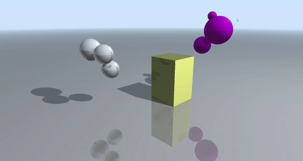
# Moving Camera Shot
Many of the lighting, shading, and geometry features are especially evident when the camera is moving, enabling us to see the scene from different angles.

<p align="center">
  
</p>

# Performance Analysis


