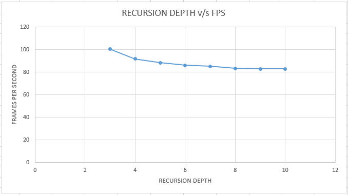

  

**University of Pennsylvania, CIS 565: GPU Programming and Architecture,
Project 5 - DirectX Procedural Raytracing**

* Author: Chhavi Sharma ([LinkedIn](https://www.linkedin.com/in/chhavi275/))
* Tested on: Windows 10, Intel Xeon CPU E5-2687W v3 @ 3.10GHz 22GB, NVIDIA TITAN V 12GB (SIGLab-VR1)

### Index

- [Introduction]( https://github.com/chhavisharma/Project5-DirectX-Procedural-Raytracing#introduction )
- [Performance Analysis](https://github.com/chhavisharma/Project5-DirectX-Procedural-Raytracing#performance-analysis )
- [Results]( https://github.com/chhavisharma/Project5-DirectX-Procedural-Raytracing#results )
- [Bloopers](https://github.com/chhavisharma/Project5-DirectX-Procedural-Raytracing#bloopers)

### Introduction

In this project, we use Microsoft's DirectX Raytracing API to ray trace procedural geometries. The code is divided into two categories, the CPU pipline for allocation and setup of DXR buffers, and, the the GPU rendering pipeline to execute the ray tracing. Microsoft introduced the DirectX Raytracing (DXR) API to allow ease of use of GPU-accelerated ray tracing in DirectX and also for interoperability with the DirectX rasterization. 

*Raytracing*, is a rendering technique for generating an image by tracing the path of light as pixels in an image plane. In Ray tracing, a light ray is shot from the camera center through each pixel. It is traced as it intersects different objects in the scene. At each interseciton, the ray is sent to to the light source, and, other rays are generated based on the material properties ( eg. reflection). If the ray interseacts another object on its way to light, then it is categorised as a shadow ray and color is assosiated with it accordingly. 

  

This diagram summarizes the DXR execution pipeline for each ray:

  

DXR also implements special Acceleration Structures namely `Bottom Level Acceleration Structure` and `Top Level Acceleration Structre` to speed up the intersection search over all objects in the scene. The BLAS hold unique defifnitions of different categories of objects in the scene. The TLAS hold various instantiations of BLAS objects which could be scaled, translated and rotated. Once these buffers are specified, DXR automatically builds optimised search routines using algorithms suck as KD-Tree search to speed up the process. 

  

### Performance Analysis

As the recursion depth increases, the frame rate drops. But visibly there isn't much gain in the the rendering quality therfore recursion depth of 3 is sufficient to render well defined images for the given scene. 

  

### Results

#### Progress Per Section 

  
  
  

  
  
  

#### Final Render

     

  
    

### Bloopers

- Error computing Meta-Ball potential

  

- Error computing Shadow Rays

  

- Error in color computation

  

