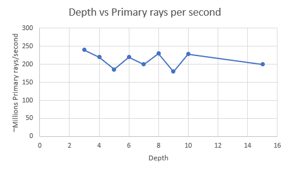

**University of Pennsylvania, CIS 565: GPU Programming and Architecture,
Project 5 - DirectX Procedural Raytracing**

* Name: Vaibhav Arcot
  *  [LinkedIn] (https://www.linkedin.com/in/vaibhav-arcot-129829167/)
* Tested on: Windows 10, i7-7700HQ @ 2.8GHz (3.8 Boost) 32GB, External GTX 1080Ti, 11G (My personal laptop)

## Overview

This repo contains a toy ray tracer using DirectX API. This differs from path tracing (can be found [here]( https://github.com/Black-Phoenix/Project3-CUDA-Path-Tracer )) in the sense that each ray has a deterministic way it bounces, so we don't need to sample multiple rays per pixel to generate a cohesive picture.

## Approach
A general overview of ray tracing is well summarized in the following picture. We first generate rays for each pixel into the scene. Once we have the rays, we then find the intersection with the ray to objects in the scene. Once we hit an object we spawn 2 types of rays, a shadow ray and depending on the material, another view ray.

The DXR pipeline follows a very similar pipeline, shown below. 

## Results

To showcase the final output, below are a few gifs of the output. The first one is with just the metaballs & spheres moving

Below is a gif of the light moving around the objects in the scene (and a pause to the animation in the middle)

Finally below is a gif of the camera moving around the stationary objects

## Analysis
Performance metrics were collected to showcase the effects of depth on various metrics

| Metric                  | Graph                                   |
| ----------------------- | --------------------------------------- |
| FPS                     |        |
| Dispatch ray function   |   |
| Primary rays per second |  |

