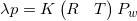
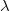
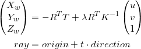
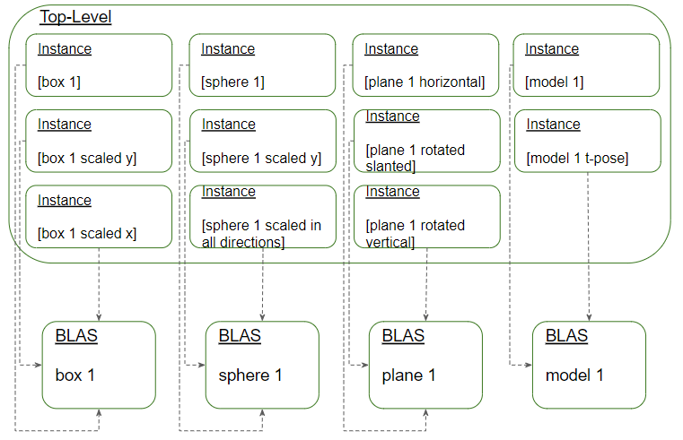

# DirectX Procedural Raytracing

**University of Pennsylvania, CIS 565: GPU Programming and Architecture,
Project 5 - DirectX Procedural Raytracing**

* Klayton Wittler
    * [LinkedIn](https://www.linkedin.com/in/klayton-wittler/)
* Tested on: Windows 10 Pro, i7-7700K @ 4.20GHz 16.0GB, GTX 1070 8.192GB (my PC)

## Conceptual Questions

1. Ray tracing begins by firing off rays from the camera's perspective, with 1 ray corresponding to 1 pixel. Say the viewport is (1280 by 720), **how would you convert these pixel locations into rays**, with each ray being defined by an `Origin` and a `Direction`, such that `Ray = Origin + t * Direction`? Consult this [intro](https://www.scratchapixel.com/lessons/3d-basic-rendering/computing-pixel-coordinates-of-3d-point/mathematics-computing-2d-coordinates-of-3d-points) to camera transformations and this [explanation](http://webglfactory.blogspot.com/2011/05/how-to-convert-world-to-screen.html) of world-to-screen/screen-to-world space article to formulate an answer in your own words.

From projective geometry, 3D space can be projected into a 2D screen with 

where  is the depth, p is the point pixel location on the camera screen, K is the camera intrinsics that control focus and camera center, R and T are the transformations from world to camera, and P is the world postion of a point. 

To create a ray from each pixel the equations above are inversed to get 

where  is a scaling factor for the parametric equation to shoot the ray into the scene as it is scaled.

2. Each procedural geometry can be defined using 3 things: the `Axis-Aligned Bounding Box` (AABB) (e.g. bottom left corner at (-1,-1,-1) and top right corner at (1,1,1)) that surrounds it, the `Type` (e.g. Sphere) of the procedural geometry contained within the AABB, and an `Equation` describing the procedural geometry (e.g. Sphere: `(x - center)^2 = r^2`). **Using these 3 constructs, conceptually explain how one could go about rendering the procedural geometry**. To be specific, consider how to proceed when a ray enters the AABB of the procedural geometry.

To render points rays are fired from each pixel in the camera. To determine if it hits any objects, simple collision checks are made with the `Axis-Aligned Bounding Box` (AABB) of each object. When a ray enters the AABB with procedural geometry, the `Type` of geometry determines which intersection shader to use in order to find out if there was a hit. Each intersection shader leverages a geometric `Equation` for the object it contains and setting an equality to the equation of a ray a hit or miss can be determined. If a hit is detected, the ray is colored, the intersection point and normal of the surface are returned to be rendered and the ray then goes to the light to determine if there is direct view or it is shadowed. If the ray must go through another object on its way to the light then it is shadowed. 

3. **Draw a diagram of the DXR Top-Level/Bottom-Level Acceleration Structures** of the following scene. Refer to section 2.6 below for an explanation of DXR Acceleration Structures. We require that you limit your answer to 1 TLAS. You may use multiple BLASes, but you must define the Geometry contained within each BLAS.

