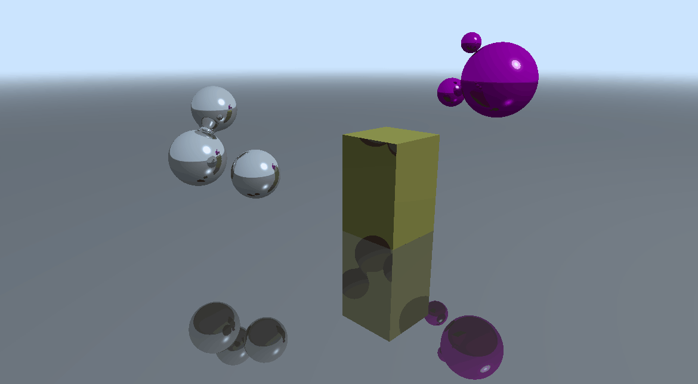

DirectX Ray Tracing
======================

**University of Pennsylvania, CIS 565: GPU Programming and Architecture,
Project 5 - DirectX Procedural Raytracing**

* Srinath Rajagopalan
  * [LinkedIn](https://www.linkedin.com/in/srinath-rajagopalan-07a43155)
* Tested on: Windows 10, i7-6700 @ 3.4GHz 16GB, Nvidia GTX 1070 (SIG Lab)

	

# Ray Tracing
In this project, we implement ray tracing for procedural geometries using DirectX Ray Tracing API. Conceptually, ray tracing is similar to path tracing with a few differences. To render a 3D scene, we project it onto a 2D image representing the plane it would be captured if we took a picture of it from the camera. Each pixel on the image has a ray associated with it. This ray is responsible for shading the pixel with a color. Like a path tracer, we trace the ray and find which objects it intersects but after that we don't recursively follow the path of the ray. As soon as it hits an object, we directly reflect it towards a light source. If the ray hits any other obstacle before the light source it is treated as a shadow ray. This is different from a path tracer where we did not explicitly handle shadows. We traced the natural course of the ray and the shadows were generated as an emergent property. In ray tracing, we have only a single pass over the scene. It's deterministic unlike the probabilistic model we had in the path tracer.

	

The ray tracing pipeline using the DirectX API is structured as follows,

	

We trace a ray, and for each we traverse the acceleration structures to determine the objects of intersection. In the path tracer object, we naively tested each ray with ALL the objects in the scene. This will not scale when we are dealing with a complex scene with many objects. Acceleration structures dramatically reduce the time taken for intersection tests by eliminating a large group of objects the ray is never likely to intersect. Fortunately we don't have to implement the acceleration structures ourselves as DXR handles this. We define the AABBs (which dramatically simplifies the ray-intersection-test logic) and the corresponding transformations and the geometry equation for each object. If the ray intersects an object, we keep going till it doesn't intersect anything else. The intersection shader is responsible for this and it computes the point of intersection and the surface normal (if there is a hit). Finally, if there is a hit, the closest hit shader is responsible for assigning a color to this ray. We only evaluate the intersection of the closest object from the camera. Using the point of intersection and the surface normal, the closest-hit shader generates a reflected ray to the light source. If the ray is intersects another object before the light source, this ray is shadowed. If it hits the light source, it is shaded by factoring both the color of the material and the color of the light source. 

## Output

Without factoring any lighting and from just the intersection tests and shadow rays, we get the following output,

	

In this project, we color the objects using the [Phong Reflection Model](https://en.wikipedia.org/wiki/Phong_reflection_model) which factors ambient, diffuse, and specular lighting.

	

If don't factor in shadows, 

	

With the camera and lighting moving, we get the following,

	

	

With just 1 recursion depth we get the following,

	

## Performance Analysis

	

Tracking the performance across multiple recursion depths. Unsurprisingly we see huge dips as we go from 1 to 3 but after that the performance is stable. In our particular scene, most rays hit a light source or are shadowed after 3-4 bounces, so there is no additional cost for extra recursion depth as the rays terminate way earlier. 

