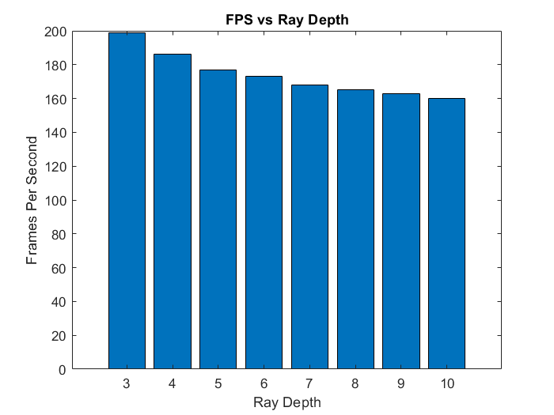

# DirectX Procedural Raytracing
**University of Pennsylvania, CIS 565: GPU Programming and Architecture,
Project 5 - DirectX Procedural Raytracing**

* Zheyuan Xie
* Tested on: Windows 10 Pro, i7-7700HQ @ 2.80GHz, 16GB, GTX 1050 2GB (Dell XPS 15 9560)

## Introduction

This project implemented ray tracing for procedural geometry using Direct X 12 Raytracing API.

Keyboard Shortcut:

 - `C` - enable/disable camera animation.
 - `G` - enable/disable geometry animation.
 - `L` - enable/disable light animation.

## Features

### Supported Geometry
 1. Triangles
    
    Triangles are supported directly in DXR.

 2. Axis-aligned Bounding Box
    
    Axis-aligned Bounding Boxs (AABBs) are the simplest type of analytic geometry primitive. The shape renders into boxes that takes all the volume of a procedural AABB. One thing to note is the box has to be axis-aligned (rotation not supported).

 3. Spheres
    
    Spheres are another very simple analytic geometry primitive defined by center and radius. The project supports multiple spheres in a single procedural AABB.
    
 4. Metaballs
    Metaballs (a.k.a blobs) are special spheres that have this potential that causes adjacent spheres to merge together. This process is rendered with a special technique using potential thresholding.

## Performance Analysis
The chart below shows how FPS changes with maximum ray depth. As maximum ray depth increases, the FPS drops slightly influenced by reflective materials in the scene.

## Reference
 - [Microsoft Direct3D 12 programming guide](https://docs.microsoft.com/en-us/windows/win32/direct3d12/directx-12-programming-guide)
 - [3D Game Engine Programming - Learning DirectX 12](https://www.3dgep.com/learning-directx-12-2/#Introduction)
 - [Microsoft DirectX-Graphics-Samples](https://github.com/microsoft/DirectX-Graphics-Samples)
 - Recitation Slides
