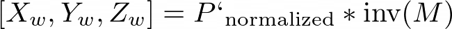

**University of Pennsylvania, CIS 565: GPU Programming and Architecture,
Project 5 - DirectX Procedural Raytracing**

* **University of Pennsylvania, CIS 565: GPU Programming and Architecture, Project 5**
  * Name: Vaibhav Arcot
    *  [LinkedIn] (https://www.linkedin.com/in/vaibhav-arcot-129829167/)
  * Tested on: Windows 10, i7-7700HQ @ 2.8GHz (3.8 Boost) 32GB, External GTX 1080Ti, 11G (Laptop)

## Overview

## Conceptual questions

Q1. Ray tracing begins by firing off rays from the camera's perspective, with 1 ray corresponding to 1 pixel. Say the viewport is (1280 by 720), **how would you convert these pixel locations into rays**, with each ray being defined by an `Origin` and a `Direction`, such that `Ray = Origin + t * Direction`? Consult this [intro](https://www.scratchapixel.com/lessons/3d-basic-rendering/computing-pixel-coordinates-of-3d-point/mathematics-computing-2d-coordinates-of-3d-points) to camera transformations and this [explanation](http://webglfactory.blogspot.com/2011/05/how-to-convert-world-to-screen.html) of world-to-screen/screen-to-world space article to formulate an answer in your own words.
A1. To define a ray in the camera frame, we first need to define the origin and direction. For the origin, we can say that the camera is located at [0,0,0] in its own frame. We can then use the inverse of the world projection matrix to convert this point from to the world frame. After doing the math, this would work out to the the translation component of the inverse of the world projection matrix. We will call this point the `camera_center`
To get the direction of the ray, we first need to find the value of the pixel in normalized coordinates. In the DXR convention, [-1, -1] is the top left pixel coordinate, and 1,1 is the bottom right coordinate. To convert a pixel coordinate (from 0 ⟶ width and 0 ⟶ height) to the normalized coordinates, we use the following equations

A final fourth dimension (h) is added so that we can multiply the point with a 4x4 matrix (and should be normalized out after the multiplication). We then can convert the coordinate from the camera frame to the world frame. This is done my multiplying the point with the inverse of the world projection matrix (which defines the camera position in the world frame).

We can then define the ray as `Ray = Origin + t * Direction`, making it `Ray = camera_center + t * [Xw, Yw, Zw]`.

Q2. Each procedural geometry can be defined using 3 things: the `Axis-Aligned Bounding Box` (AABB) (e.g. bottom left corner at (-1,-1,-1) and top right corner at (1,1,1)) that surrounds it, the `Type` (e.g. Sphere) of the procedural geometry contained within the AABB, and an `Equation` describing the procedural geometry (e.g. Sphere: `(x - center)^2 = r^2`). **Using these 3 constructs, conceptually explain how one could go about rendering the procedural geometry**. To be specific, consider how to proceed when a ray enters the AABB of the procedural geometry.

A2. First, we determine if the ray intersects with the AABB box. If the ray does not intersect with the box, we don't need to perform any more checks. If the box does intersect, we then call the appropriate shader based on the contents of the box (`Type`)and the type of the ray (reflected, shadow, etc.). Once the appropriate shader is called, it will use the `Equation` of the shape to determine if the shape intersects with the ray. This shader also has access to time so it can move the objects and allow for cool interactions such as metaballs. This shader will then return the appropriate information (hit or miss for a shadow ray, normals and color for reflected rays).

Q3. **Draw a diagram of the DXR Top-Level/Bottom-Level Acceleration Structures** of the following scene. Refer to section 2.6 below for an explanation of DXR Acceleration Structures. We require that you limit your answer to 1 TLAS. You may use multiple BLASes, but you must define the Geometry contained within each BLAS.
 
A3.