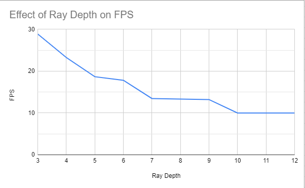

**University of Pennsylvania, CIS 565: GPU Programming and Architecture,
Project 5 - DirectX Procedural Raytracing**

* Taylor Nelms
  * [LinkedIn](https://www.linkedin.com/in/taylor-k-7b2110191/), [twitter](https://twitter.com/nelms_taylor)
* Tested on: Windows 10, Intel i3 Coffee Lake 4-core 3.6GHz processor, 16GB RAM, NVidia GeForce GTX1650 4GB

### DXR Ray Tracer

In this engine implementation, we make use of DirectX's ray tracing utilities to render a hardcoded scene of procedural geometries. By making use of the built-in acceleration structures for geometry traversal, we are able to render a fully ray-traced image at real-time speeds, a feat that is impossible with CPU-based implementations.

### Performance

With only a few geometries to work with, we can look at how the depth of the render engine affects performance overall. It turns out, it does not take too deep of a traversal to slow the performance down to a screeching halt.

