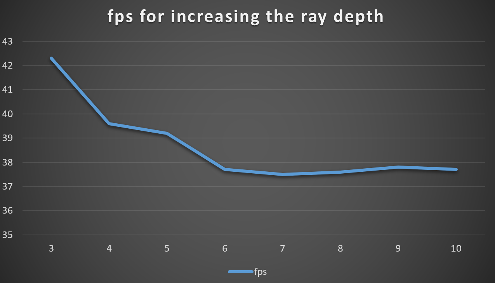
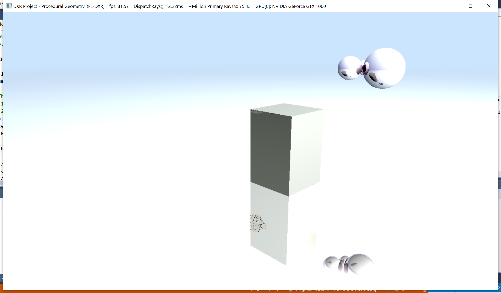

**University of Pennsylvania, CIS 565: GPU Programming and Architecture,
Project 5 - DirectX Procedural Raytracing**

- Yan Dong
  - [LinkedIn](https://www.linkedin.com/in/yan-dong-572b1113b/)
  - [personal website](https://www.coffeier.com)
  - [github](https://github.com/coffeiersama)
- Tested on: Windows 10, i7-8750 @ 2.22GHz  (12CPUs)  16GB, GTX 1060 14202MB (OMEN 15-dc0xxx)

[Result](#result) - [Rules](#feature) - [Performance Analysis](#performance-analysis) - [Bloppers](#bloopers)

## Result

(gif seems compress some quality of picture)

## Feature

all basic implement: metaball, sphere, and box

Optimize Metaball Rendering

##### DXR Pipeline

There is detailed document for the DXR API, I think it can be separated into two parts: pass the data from CPU to GPU, do the ray tracing in GPU.

All detailed things can get in the reference website and the given slides.

##### Optimize Metaball Rendering

we want to loop over only active metaballs(intersect by the ray) to save the calculating time. The basic idea is when you do the intersection test,  change the meta ball array, only store the active meta balls. They only calculate potential for these balls.

without optimizing, the fps is: (5 metaballs, ray depth 10)

with optimizing, the fps is :

## Performance-analysis

When we increase the ray depth from 3 to 10, at first the fps decrease obviously. But then, it do not decrease. I think this is caused by this very simple scene. Only having metaball and simple reflect materials, large ray depth is waste.

## Bloppers

##### no metaball

This happened when I cannot see my metaball, there are two reasons.

The first is I calculate wrong ratio of the potential value. 

The second is that after dividing 128 parts along tmin and tmax, I make the wrong calculation for the current position.(I used ray.origin + i*step * ray.direction, omit tmin iteself)

##### wrong color

the result is much lighter than it should be, check the code and equation, finally find that  need  to use abs((dot(normalize(I), normalize(N)))) to  make sure 2 rays are doing the dot with the smaller angle(<90).

## Reference

 https://docs.microsoft.com/en-us/windows/win32/direct3d12/raytcurrent 

 http://cwyman.org/code/dxrTutors/tutors/Tutor4/tutorial04.md.html 

 http://www.visualextract.com/posts/introduction-to-dxr/ 

 http://intro-to-dxr.cwyman.org/presentations/IntroDXR_RaytracingShaders.pdf 

 https://github.com/Microsoft/DirectX-Graphics-Samples 

## Thanks

Thanks Zheyuan Xie for helping me with lots of explanation of DXR API